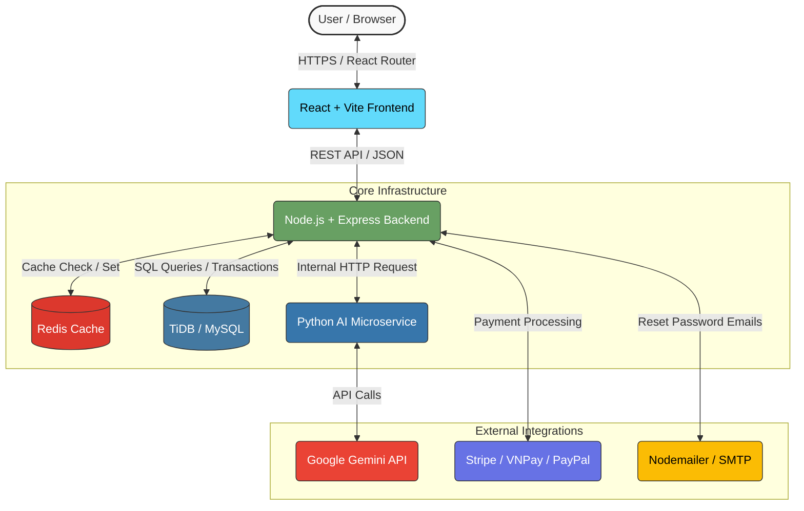

<p align="center">
  
</p>
***Website link:** https://dhp-store.onrender.com

*(Wait a few seconds for the site to load)*
## *Overview*
DHP Store is a full-stack e-commerce application implementing a modern React (Vite) frontend and a Node.js + Express backend with MySQL (TiDB). The project includes user authentication, a shopping flow, admin management tools, file uploads, role-based access control, server-side protections such as rate limiting, and an AI-powered product recommendation engine. Orders and inventory updates use transactional operations to maintain data integrity, while a Redis caching layer ensures lightning-fast product retrieval.

## ✨ Key Features
### Customer experience

- **User Authentication:** Secure Login & Registration with JWT based sessions and Bcrypt hashing and password-reset flows.

- **Profile Management:** Users can update personal info, upload profile pictures, and change passwords.

- **Product Browsing:** Browse products with search functionality and category filtering.

- **Shopping Cart:** Real-time cart management (add, remove, update quantities) and sent to server to update database.

- **AI intergration:**Smart chatbot and personalized product recommendations based on vector similarity.

- **Checkout System:**
   - Delivery information validation.

   - Multiple Payment Gateways: Stripe (Credit Card), VNPay (QR/ATM), PayPal, and COD.

- **Order History:** Users can track the status of their orders (New, Confirmed, Shipping, etc.) via their account dashboard.
- **Feedback System**: Customers can leave feedback; backend stores and exposes feedback entries.

### 📈 Admin & Staff Dashboard
- **Role-Based Access (RBAC)**: `requireRole` middleware for admin-only routes and protected admin UI.
- **Product and Order management**: 
   - View all orders with customer details and item breakdowns, update order statuses.
   - Product listing, filtering, product details with images (uploads supported).

### 🔐 Security
- **Rate limiting:** IP rate limiting middleware to protect endpoints
- **Secure cookies:** HttpOnly cookies for session management.
- **Protected Routes**: Frontend protected routes for authenticated areas (`ProtectedRoute` component).
### ⚙️ Technical
- **Unified Deployment:** The backend is configured to serve the React frontend static build, allowing for single-port deployment (ideal for Ngrok tunneling).
- **Database:** Optimized MySQL queries with connection pooling.
- **Caching:** edis implementation for high-speed data retrieval on product listings and details, with automatic cache invalidation on mutations.
- **Docker Support**: `docker-compose.yml` + `Dockerfile` for client and server to run in containers.

### 🛠️ Tech Stack
Frontend: React.js, Vite, CSS3

Backend: Node.js, Express.js

Database & Caching: MySQL, Redis

Payments: Stripe API, PayPal SDK, VNPay integration

Tools: Multer (File Uploads), Nodemailer (Emails), Ngrok (Tunneling)

Deployment: Render (node) and TiDB Cloud (mysql)

## 🏛 Architecture

**Architechure overview:**
- Frontend (React/Vite): The user interacts with the UI, sending requests to the main backend.

- Backend (Node.js/Express): Handles authentication, routing, rate limiting, and business logic.

- Caching Layer (Redis): Intercepts high-traffic read queries (like product lists and categories) to serve data instantly, reducing database load. Invalidation occurs automatically on product updates.

- Database (TiDB/MySQL): The primary source of truth for users, products, orders, and transactional data.

- AI Microservice (Python): An independent service that handles natural language processing and vector similarity searches to provide smart chatbot responses and personalized product recommendations.

**System flow:**

## 🌐 API Documentation

Below is a summary of the core REST API endpoints available in the Node.js backend. 

* **Auth**: 🔒 Requires valid JWT session cookie.
* **Role**: 🛡️ Requires specific roles (`Staff` or `Admin`).
* **Cache**: ⚡ Response is cached in Redis.

### 👤 Authentication & Users (`/api/auth`)
| Method | Endpoint | Description | Access |
| :--- | :--- | :--- | :--- |
| `POST` | `/register` | Register a new user account. | Public |
| `POST` | `/login` | Authenticate user and issue HttpOnly JWT cookie. | Public |
| `POST` | `/logout` | Clear the JWT session cookie. | Public |
| `GET`  | `/profile` | Get current user details, order stats, and vouchers. | 🔒 User |
| `PUT`  | `/profile` | Update user phone number and address. | 🔒 User |
| `POST` | `/upload-profile-picture` | Upload and set a new user avatar. | 🔒 User |
| `POST` | `/forgot-password` | Generate reset token and send recovery email. | Public |
| `POST` | `/reset-password` | Reset password using the email token. | Public |
| `POST` | `/change-password` | Update password for an already logged-in user. | 🔒 User |

### 👕 Products (`/api/products`)
| Method | Endpoint | Description | Access |
| :--- | :--- | :--- | :--- |
| `GET`  | `/` | Get all products (supports `?q=` and `?categoryId=` filters). | ⚡ Public |
| `GET`  | `/categories` | Fetch all available product categories. | ⚡ Public |
| `GET`  | `/:id` | Get details for a specific product. | ⚡ Public |
| `POST` | `/` | Create a new product with image upload. | 🛡️ Admin |
| `PUT`  | `/:id/stock` | Update the inventory stock for a product. | 🛡️ Staff/Admin |
| `DELETE`| `/:id` | Soft-delete a product (sets `is_active = false`). | 🛡️ Admin |

### 🤖 AI Services (`/api/recommend`, `/api/chat`)
| Method | Endpoint | Description | Access |
| :--- | :--- | :--- | :--- |
| `GET`  | `/recommend/user` | Get personalized product recommendations. | 🔒 User |
| `GET`  | `/recommend/product/:id` | Get visually/thematically similar products. | Public |
| `POST` | `/chat` | Send a message to the Gemini-powered AI chatbot. | Public |

### 🛒 Cart & Orders (`/api/cart`, `/api/orders`)
| Method | Endpoint | Description | Access |
| :--- | :--- | :--- | :--- |
| `GET`  | `/cart` | Retrieve the current user's shopping cart. | 🔒 User |
| `POST` | `/cart` | Add an item or update quantity in the cart. | 🔒 User |
| `DELETE`| `/cart/:id` | Remove an item from the cart. | 🔒 User |
| `POST` | `/orders` | Process checkout and create a new order. | 🔒 User |
| `GET`  | `/orders` | Get the logged-in user's order history. | 🔒 User |
| `GET`  | `/orders/all` | View all system orders for management. | 🛡️ Staff/Admin |
| `PUT`  | `/orders/:id/status`| Update an order's fulfillment status. | 🛡️ Staff/Admin |

### ⚙️ System
| Method | Endpoint | Description | Access |
| :--- | :--- | :--- | :--- |
| `GET`  | `/api/health` | Health check endpoint (used for keep-alive Cron Jobs). | Public |

## 🗂 Project Structure
```text
dhp-store/
├── docker-compose.yml
├── package.json
├── client/                       # Frontend (React + Vite)
│   ├── Dockerfile
│   ├── index.html
│   ├── nginx.conf
│   ├── package.json
│   ├── vite.config.js
│   └── src
│       ├── api.js
│       ├── main.jsx
│       ├── App.jsx
│       ├── styles.css
│       ├── assets/
│       ├── components/
│       │   ├── Navbar.jsx
│       │   ├── CartDrawer.jsx
│       │   └── ProtectedRoute.jsx
│       ├── context/
│       │   ├── AuthContext.jsx
│       │   └── CartContext.jsx
│       └── pages/
│           ├── Home.jsx
│           ├── Products.jsx
│           ├── ProductDetails.jsx
│           ├── Cart.jsx
│           ├── Checkout.jsx
│           ├── Login.jsx
│           ├── Account.jsx
│           ├── ResetPassword.jsx
│           ├── Contact.jsx
│           └── admin/
│               ├── AdminLayout.jsx
│               ├── AdminDashboard.jsx
│               ├── ManageProducts.jsx
│               └── ManageOrders.jsx
├── server/                       # Backend (Node.js + Express)
│   ├── Dockerfile
│   ├── package.json
│   └── src
│       ├── index.js              # Express app entry
│       ├── db.js                 # MySQL connection + transaction helpers
│       ├── cache/                
│       │   └── redis.js          # Redis connection instance
│       ├── middleware/
│       │   ├── requireAuth.js
│       │   ├── requireRole.js
│       │   ├── rateLimit.js
│       │   └── upload.js
│       ├── routes/
│       │   ├── auth.js
│       │   ├── products.js
│       │   ├── cart.js
│       │   ├── orders.js
│       │   └── feedback.js
│       └── uploads/              # Uploaded images/files
├── ai-service/                   # AI Recommendation Microservice (Python)
│   ├── main.py
│   └── recommender.py
└── README.md
```

## To run the project

### Prerequisites
- Node.js (v16+)

- MySQL server

- Redis server

- Python 3.9+ (for AI service)

- Docker (optional, for containerized setup)

### Installation (local)
1. Clone the repository and enter the project folder:

```bash
git clone https://github.com/dhp-exe/e-commercial-project.git
cd dhp-store
```

2. Install server dependencies:

```bash
cd server
npm install
```

3. Create a `.env` file in `server/` with these variables:

```env
DB_HOST=your_database_host
DB_USER=your_database_user
DB_PASSWORD=your_database_password
DB_NAME=your_database_name
JWT_SECRET=your_jwt_secret
REDIS_URL=...
AI_SERVICE_URL=...
PORT=...
```

4. Install client dependencies:

```bash
cd ../client
npm install
```
5. Create `.env` file in `client/`
```bash
VITE_STRIPE_PUBLIC_KEY=your_stripe_public_key
```
6. Setup AI service (optional):
```bash
cd ../ai-service
pip install -r requirements.txt
```
7. Create a .env file in ai-service/:
```bash
GOOGLE_API_KEY=your_gemini_api_key
DB_HOST=your_database_host
```

### Running the Application (local)

Start the backend:

```bash
cd server
npm start
```

Start the frontend (dev server):

```bash
cd ../client
npm run dev
```
Start AI service (optional):
```bash
cd ai-service
uvicorn main:app --port 10000
```

### Running with Docker

From the `dhp-store` root (requires Docker & Docker Compose):

```bash
docker-compose up --build
```
Docker flow:
```
               Browser
                  │
                  ▼
         localhost:5173
                  │
          ┌─────────────┐
          │  Frontend   │  (container)
          └─────────────┘
                  │
                  ▼
          ┌─────────────┐
          │   Backend   │  (container)
          └─────────────┘
           │           │
           ▼           ▼
    ┌───────────┐  ┌────────────┐
    │   Redis   │  │ AI Service │
    │ container │  │ container  │
    └─────┬─────┘  └────────────┘
          │
          ▼
    ┌───────────┐
    │  Volume   │
    │ redis_data│
    └───────────┘
```
## Notes
- Database migrations and seed scripts can be added to `server/src` to initialize sample data.
- Add automated tests for critical routes and payment/checkout flows.

### License
This project is licensed under the MIT License.
