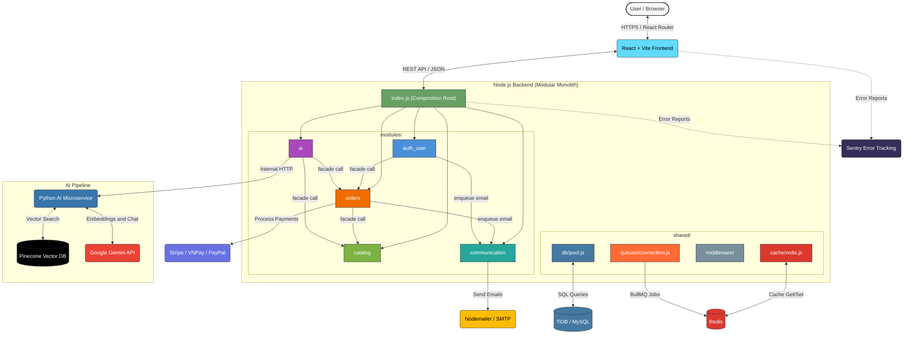
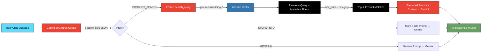
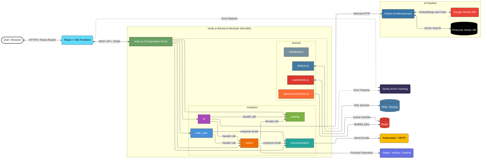

<p align="center">
  
</p>
***Website link:** https://www.dhpstore.studio

*(Wait a few seconds for the site to load)*

## *Overview*
DHP Store is a production-grade, full-stack e-commerce platform built with a **Modular Monolith** architecture and **Event-Driven** background processing. The application features a modern React (Vite) frontend, a Node.js + Express backend with BullMQ job queues, a Python AI microservice powered by a **Hybrid RAG pipeline** (Pinecone Vector DB + Google Gemini), and a TiDB/MySQL database with Redis caching. The system supports Google OAuth, multiple payment gateways, admin tooling, real-time error monitoring via Sentry, and SEO-optimized rendering — all containerized with Docker Compose for reproducible deployments.

## ✨ Key Features
### Customer Experience

- **User Authentication:** Secure login & registration with JWT-based sessions, Bcrypt hashing, password-reset flows, and **Google OAuth** (one-click "Continue with Google" via Google Identity Services).

- **Profile Management:** Users can update personal info, upload profile pictures, and change passwords (disabled for Google-linked accounts).

- **Product Browsing:** Browse products with search functionality, category filtering, and semantic AI-powered recommendations.

- **Shopping Cart:** Real-time cart management (add, remove, update quantities) with server-side persistence.

- **AI-Powered Chatbot & Recommendations:** A Gemini-powered conversational assistant ("Naviah") provides personalized product recommendations using a **Hybrid RAG pipeline** — queries are semantically embedded, matched against a Pinecone vector index, and grounded with strict hallucination guardrails.

- **Checkout System:**
   - Delivery information validation.
   - Multiple Payment Gateways: Stripe (Credit Card), VNPay (QR/ATM), PayPal, and COD.
   - Stripe webhook processing via BullMQ for reliable, idempotent payment confirmation.

- **Order History:** Users can track the status of their orders (New, Confirmed, Shipping, etc.) via their account dashboard.
- **Feedback System**: Customers can leave feedback; backend stores and exposes feedback entries.

### 📈 Admin & Staff Dashboard
- **Role-Based Access (RBAC)**: `requireRole` middleware for admin-only routes and protected admin UI.
- **Product and Order management**: 
   - View all orders with customer details and item breakdowns, update order statuses.
   - Product listing, filtering, product details with images (uploads supported).
- **BullMQ Dashboard**: Admins can monitor job queues (email, Stripe, AI refresh, cache, cart cleanup) via the integrated **Bull Board** UI at `/admin/queues`.

### 🔐 Security
- **Rate Limiting:** IP-based rate limiting middleware to protect all endpoints, with specialized auth limiters.
- **Secure Cookies:** HttpOnly cookies with environment-driven `SameSite` and `Secure` configuration.
- **Helmet:** Hardened HTTP headers with a strict Content Security Policy (CSP).
- **Protected Routes**: Frontend protected routes for authenticated areas (`ProtectedRoute` component).

### 📊 Observability
- **Sentry Integration:** Full-stack error tracking and performance monitoring across both the React frontend (`@sentry/react`) and Node.js backend (`@sentry/node`), including automated Express error handler middleware.

### ⚙️ Technical
- **Event-Driven Architecture (BullMQ):** All heavy or side-effect operations are processed asynchronously through Redis-backed job queues and dedicated workers, co-located within their owning domain module:
  | Queue | Module | Worker | Purpose |
  |:---|:---|:---|:---|
  | `email` | `communication` | `emailWorker` | Order confirmation & password-reset emails (Nodemailer) |
  | `stripe-webhook` | `orders` | `stripeWorker` | Idempotent Stripe payment event processing |
  | `ai-refresh` | `ai` | `aiRefreshWorker` | Re-syncs product vectors to Pinecone |
  | `cache-invalidate` | `catalog` | `cacheWorker` | Invalidates and warms Redis cache entries |
  | `cart-cleanup` | `orders` | `cartCleanupWorker` | Weekly cron to purge abandoned guest carts |
  | `reservation-cleanup` | `catalog` | `reservationCleanupWorker` | 5-minute cron to release expired inventory reservations |

- **Graceful Shutdown:** On SIGTERM/SIGINT, all BullMQ workers drain in-progress jobs, queues close, and the HTTP server shuts down cleanly.
- **Database:** Optimized MySQL queries with connection pooling against TiDB Serverless (cloud).
- **Caching:** Redis implementation for high-speed data retrieval on product listings, categories, and sitemap XML, with automatic cache invalidation on mutations.
- **SEO:** Dynamic `<meta>` tags via `react-helmet-async`, Open Graph tags in `index.html`, and a server-generated `GET /sitemap.xml` route (Redis-cached, auto-populated from TiDB).
- **Docker Support**: Multi-service `docker-compose.yml` with containers for client, server, AI service, and Redis.

### 🛠️ Tech Stack

| Layer | Technologies |
|:---|:---|
| **Frontend** | React 18, Vite, CSS3, TanStack Query, react-helmet-async, Google Identity Services |
| **Backend** | Node.js, Express.js, BullMQ, Helmet, Morgan |
| **AI / ML** | Python 3, FastAPI, Google Gemini (`google-genai`), Pinecone Vector DB, Pydantic, cachetools |
| **Database & Caching** | TiDB Cloud (MySQL), Redis |
| **Payments** | Stripe API (webhooks), PayPal SDK, VNPay |
| **Auth** | JWT, Bcrypt, Google OAuth 2.0 |
| **Observability** | Sentry (frontend + backend) |
| **DevOps** | Docker, Docker Compose, Nginx, GitHub Actions CI, Release Please |
| **Utilities** | Multer (file uploads), Nodemailer (emails) |

## 🏛 Architecture

**Architecture overview:**

The system follows a **Modular Monolith** pattern: the Node.js backend is organized into five **domain modules** (`auth_user`, `catalog`, `orders`, `communication`, `ai`) with a **shared infrastructure layer** (`shared/`). Each module encapsulates its own routes, controllers, services, repositories, queues, and workers behind a public facade (`index.js`). Cross-module communication is restricted to facade-exposed functions and BullMQ queues — no module may directly access another module's repository or database tables.

- **Frontend (React/Vite):** Single-page application with client-side routing, TanStack Query for server-state management, and Sentry for error tracking. Google Identity Services provides one-click OAuth login.

- **Backend (Node.js/Express):** The API server's `index.js` serves as the **composition root**, importing exclusively from `shared/` and `modules/*/index.js`. Each domain module owns its business logic, data access, and background jobs. Heavy side-effects are processed asynchronously through BullMQ queues — dedicated workers co-located within their owning modules handle emails, payment webhooks, cache invalidation, cart cleanup, inventory reservation cleanup, and AI refreshes.

- **Caching Layer (Redis):** Serves dual roles — both as a high-speed cache for product listings, categories, and the sitemap XML, and as the **message broker** for BullMQ job queues.

- **Database (TiDB/MySQL):** The primary source of truth for users, products, orders, and transactional data. Each module encapsulates its SQL access in a dedicated `repository.js` using the shared connection pool.

- **AI Microservice (Python/FastAPI):** An independent service that powers the Hybrid RAG pipeline — embedding product catalogs into Pinecone, performing semantic vector search, and using Gemini for conversational synthesis with strict grounding guardrails.

**System Flow:**

```mermaid
graph TD
    %% External Actors
    User([User / Browser])
    Sentry(Sentry Error Tracking)

    %% Frontend
    Frontend(React + Vite Frontend)

    %% External Services
    Payments(Stripe / VNPay / PayPal)
    EmailSMTP(Nodemailer / SMTP)
    AIService(Python AI Microservice)
    Pinecone[(Pinecone Vector DB)]
    Gemini(Google Gemini API)

    %% Infrastructure
    Redis[(Redis)]
    TiDB[(TiDB / MySQL)]

    %% Define Connections
    User <-->|HTTPS / React Router| Frontend
    Frontend <-->|REST API / JSON| CompositionRoot
    Frontend -.->|Error Reports| Sentry

    subgraph "Node.js Backend (Modular Monolith)"
        CompositionRoot["index.js (Composition Root)"]

        subgraph "shared/"
            Pool["db/pool.js"]
            RedisClient["cache/redis.js"]
            MW["middleware/"]
            QConn["queues/connection.js"]
        end

        subgraph "modules/"
            AuthUser["auth_user"]
            Catalog["catalog"]
            Orders["orders"]
            Comm["communication"]
            AI["ai"]
        end

        CompositionRoot --> AuthUser
        CompositionRoot --> Catalog
        CompositionRoot --> Orders
        CompositionRoot --> Comm
        CompositionRoot --> AI

        AuthUser -->|facade call| Orders
        Orders -->|facade call| Catalog
        Orders -->|enqueue email| Comm
        AuthUser -->|enqueue email| Comm
        AI -->|facade call| Catalog
        AI -->|facade call| Orders
    end

    %% Infrastructure Connections
    Pool <-->|SQL Queries| TiDB
    RedisClient <-->|Cache Get/Set| Redis
    QConn -->|BullMQ Jobs| Redis
    AI -->|Internal HTTP| AIService
    Comm -->|Send Emails| EmailSMTP
    Orders -->|Process Payments| Payments
    CompositionRoot -.->|Error Reports| Sentry

    subgraph "AI Pipeline"
        AIService <-->|Embeddings and Chat| Gemini
        AIService <-->|Vector Search| Pinecone
    end

    %% Styling
    style User fill:#f9f9f9,stroke:#333,stroke-width:2px
    style Frontend fill:#61dafb,stroke:#333,color:#000
    style CompositionRoot fill:#68a063,stroke:#333,color:#fff
    style AuthUser fill:#4a90d9,stroke:#333,color:#fff
    style Catalog fill:#7cb342,stroke:#333,color:#fff
    style Orders fill:#ef6c00,stroke:#333,color:#fff
    style Comm fill:#26a69a,stroke:#333,color:#fff
    style AI fill:#ab47bc,stroke:#333,color:#fff
    style Redis fill:#dc382d,stroke:#333,color:#fff
    style TiDB fill:#4479a1,stroke:#333,color:#fff
    style AIService fill:#3776ab,stroke:#333,color:#fff
    style Pinecone fill:#000000,stroke:#333,color:#fff
    style Gemini fill:#ea4335,stroke:#333,color:#fff
    style Payments fill:#6772e5,stroke:#333,color:#fff
    style EmailSMTP fill:#fbbc04,stroke:#333,color:#000
    style Sentry fill:#362d59,stroke:#333,color:#fff
    style Pool fill:#4479a1,stroke:#333,color:#fff
    style RedisClient fill:#dc382d,stroke:#333,color:#fff
    style MW fill:#78909c,stroke:#333,color:#fff
    style QConn fill:#ff6b35,stroke:#333,color:#fff
```

**Hybrid RAG AI Pipeline:**

```mermaid
flowchart LR
    A[User Chat Message] --> B[Gemini Structured Output]
    B -->|SearchFilters JSON| C{Intent?}
    C -->|STORE_INFO| D[Store Facts Prompt → Gemini]
    C -->|GENERAL| E[General Prompt → Gemini]
    C -->|PRODUCT_SEARCH| F[Embed search_query]
    F -->|gemini-embedding-2| G[768-dim Vector]
    G --> H[Pinecone Query + Metadata Filters]
    H -->|max_price · category| I[Top-K Product Matches]
    I --> J[Grounded Prompt + Context → Gemini]
    J --> K[AI Response to User]
    D --> K
    E --> K

    style A fill:#61dafb,stroke:#333,color:#000
    style B fill:#ea4335,stroke:#333,color:#fff
    style F fill:#ea4335,stroke:#333,color:#fff
    style G fill:#3776ab,stroke:#333,color:#fff
    style H fill:#000000,stroke:#333,color:#fff
    style I fill:#000000,stroke:#333,color:#fff
    style J fill:#ea4335,stroke:#333,color:#fff
    style K fill:#68a063,stroke:#333,color:#fff
```

**Event-Driven Job Processing (BullMQ):**

  | Queue | Module Owner | Worker | Purpose |
  |:---|:---|:---|:---|
  | `email` | `communication` | `emailWorker` | Order confirmation & password-reset emails (Nodemailer) |
  | `stripe-webhook` | `orders` | `stripeWorker` | Idempotent Stripe payment event processing |
  | `ai-refresh` | `ai` | `aiRefreshWorker` | Re-syncs product vectors to Pinecone |
  | `cache-invalidate` | `catalog` | `cacheWorker` | Invalidates and warms Redis cache entries |
  | `cart-cleanup` | `orders` | `cartCleanupWorker` | Weekly cron to purge abandoned guest carts |
  | `reservation-cleanup` | `catalog` | `reservationCleanupWorker` | 5-minute cron to release expired inventory reservations |


```mermaid
---
config:
  layout: elk
---
flowchart LR
 subgraph s1["shared/"]
        Pool["db/pool.js"]
        RedisClient["cache/redis.js"]
        MW["middleware/"]
        QConn["queues/connection.js"]
  end
 subgraph s2["modules/"]
        AuthUser["auth_user"]
        Catalog["catalog"]
        Orders["orders"]
        Comm["communication"]
        AI["ai"]
  end
 subgraph subGraph2["Node.js Backend (Modular Monolith)"]
        CompositionRoot["index.js (Composition Root)"]
        s1
        s2
  end
 subgraph subGraph3["AI Pipeline"]
        Gemini("Google Gemini API")
        AIService("Python AI Microservice")
        Pinecone[("Pinecone Vector DB")]
  end
    User(["User / Browser"]) <-- HTTPS / React Router --> Frontend("React + Vite Frontend")
    Frontend <-- REST API / JSON --> CompositionRoot
    Frontend -. Error Reports .-> Sentry("Sentry Error Tracking")
    CompositionRoot --> AuthUser & Catalog & Orders & Comm & AI
    AuthUser -- facade call --> Orders
    Orders -- facade call --> Catalog
    Orders -- enqueue email --> Comm
    AuthUser -- enqueue email --> Comm
    AI -- facade call --> Catalog & Orders
    Pool <-- SQL Queries --> TiDB[("TiDB / MySQL")]
    RedisClient <-- Cache Get/Set --> Redis[("Redis")]
    AI -- Internal HTTP --> AIService
    Comm -- Send Emails --> EmailSMTP("Nodemailer / SMTP")
    Orders -- Process Payments --> Payments("Stripe / VNPay / PayPal")
    CompositionRoot -. Error Reports .-> Sentry
    AIService <-- Embeddings and Chat --> Gemini
    AIService <-- Vector Search --> Pinecone
    QConn -- BullMQ Jobs --> Redis

    style Pool fill:#4479a1,stroke:#333,color:#fff
    style RedisClient fill:#dc382d,stroke:#333,color:#fff
    style MW fill:#78909c,stroke:#333,color:#fff
    style QConn fill:#ff6b35,stroke:#333,color:#fff
    style AuthUser fill:#4a90d9,stroke:#333,color:#fff
    style Catalog fill:#7cb342,stroke:#333,color:#fff
    style Orders fill:#ef6c00,stroke:#333,color:#fff
    style Comm fill:#26a69a,stroke:#333,color:#fff
    style AI fill:#ab47bc,stroke:#333,color:#fff
    style CompositionRoot fill:#68a063,stroke:#333,color:#fff
    style Gemini fill:#ea4335,stroke:#333,color:#fff
    style AIService fill:#3776ab,stroke:#333,color:#fff
    style Pinecone fill:#000000,stroke:#333,color:#fff
    style User fill:#f9f9f9,stroke:#333,stroke-width:2px
    style Frontend fill:#61dafb,stroke:#333,color:#000
    style Sentry fill:#362d59,stroke:#333,color:#fff
    style TiDB fill:#4479a1,stroke:#333,color:#fff
    style Redis fill:#dc382d,stroke:#333,color:#fff
    style EmailSMTP fill:#fbbc04,stroke:#333,color:#000
    style Payments fill:#6772e5,stroke:#333,color:#fff
```

## 🌐 API Documentation

Below is a summary of the core REST API endpoints available in the Node.js backend. 

* **Auth**: 🔒 Requires valid JWT session cookie.
* **Role**: 🛡️ Requires specific roles (`Staff` or `Admin`).
* **Cache**: ⚡ Response is cached in Redis.

### 👤 Authentication & Users (`/api/auth`)
| Method | Endpoint | Description | Access |
| :--- | :--- | :--- | :--- |
| `POST` | `/register` | Register a new user account. | Public |
| `POST` | `/login` | Authenticate user and issue HttpOnly JWT cookie. | Public |
| `POST` | `/google` | Authenticate via Google OAuth token (auto-registers if new). | Public |
| `POST` | `/logout` | Clear the JWT session cookie. | Public |
| `GET`  | `/profile` | Get current user details, order stats, and vouchers. | 🔒 User |
| `PUT`  | `/profile` | Update user phone number and address. | 🔒 User |
| `POST` | `/upload-profile-picture` | Upload and set a new user avatar. | 🔒 User |
| `POST` | `/forgot-password` | Generate reset token and send recovery email (via BullMQ). | Public |
| `POST` | `/reset-password` | Reset password using the email token. | Public |
| `POST` | `/change-password` | Update password for an already logged-in user. | 🔒 User |

### 👕 Products (`/api/products`)
| Method | Endpoint | Description | Access |
| :--- | :--- | :--- | :--- |
| `GET`  | `/` | Get all products (supports `?q=` and `?categoryId=` filters). | ⚡ Public |
| `GET`  | `/categories` | Fetch all available product categories. | ⚡ Public |
| `GET`  | `/:id` | Get details for a specific product. | ⚡ Public |
| `POST` | `/` | Create a new product with image upload. | 🛡️ Admin |
| `PUT`  | `/:id/stock` | Update the inventory stock for a product. | 🛡️ Staff/Admin |
| `DELETE`| `/:id` | Soft-delete a product (sets `is_active = false`). | 🛡️ Admin |

### 🤖 AI Services (`/api/recommend`, `/api/chat`)
| Method | Endpoint | Description | Access |
| :--- | :--- | :--- | :--- |
| `GET`  | `/recommend/user` | Get personalized product recommendations. | 🔒 User |
| `GET`  | `/recommend/product/:id` | Get semantically similar products (Pinecone vector search). | Public |
| `POST` | `/recommend/refresh` | Trigger Pinecone re-sync and cache clear (via BullMQ). | 🛡️ Admin |
| `POST` | `/chat` | Send a message to the Gemini-powered AI chatbot (Hybrid RAG). | Public |

### 🛒 Cart & Orders (`/api/cart`, `/api/orders`)
| Method | Endpoint | Description | Access |
| :--- | :--- | :--- | :--- |
| `GET`  | `/cart` | Retrieve the current user's shopping cart. | 🔒 User |
| `POST` | `/cart` | Add an item or update quantity in the cart. | 🔒 User |
| `DELETE`| `/cart/:id` | Remove an item from the cart. | 🔒 User |
| `POST` | `/orders` | Process checkout and create a new order. | 🔒 User |
| `GET`  | `/orders` | Get the logged-in user's order history. | 🔒 User |
| `GET`  | `/orders/all` | View all system orders for management. | 🛡️ Staff/Admin |
| `PUT`  | `/orders/:id/status`| Update an order's fulfillment status. | 🛡️ Staff/Admin |

### ⚙️ System & SEO
| Method | Endpoint | Description | Access |
| :--- | :--- | :--- | :--- |
| `GET`  | `/api/health` | Health check endpoint (used for uptime monitoring). | Public |
| `GET`  | `/sitemap.xml` | Dynamic XML sitemap (Redis-cached, auto-populated from TiDB). | ⚡ Public |
| `GET`  | `/admin/queues` | Bull Board dashboard for monitoring BullMQ job queues. | 🛡️ Admin |

## 🗂 Project Structure
```text
dhp-store/
├── docker-compose.yml
├── package.json
├── client/                                  # Frontend (React + Vite)
│   ├── Dockerfile
│   ├── index.html                           # SEO meta tags, Google Identity Services
│   ├── nginx.conf
│   ├── package.json
│   ├── vite.config.js
│   └── src/
│       ├── api.js
│       ├── main.jsx                         # Sentry init, TanStack Query, HelmetProvider
│       ├── App.jsx
│       ├── styles.css
│       ├── assets/
│       ├── components/
│       │   ├── Navbar.jsx
│       │   ├── CartDrawer.jsx
│       │   ├── ChatBot.jsx                  # AI chatbot widget
│       │   ├── GoogleLoginButton.jsx
│       │   ├── LoadingScreen.jsx
│       │   ├── RecommendRow.jsx
│       │   └── ProtectedRoute.jsx
│       ├── context/
│       │   ├── AuthContext.jsx               # JWT + Google OAuth state
│       │   ├── CartContext.jsx
│       │   └── SearchContext.jsx
│       ├── hooks/
│       │   └── useProducts.js                # TanStack Query hook factory
│       └── pages/
│           ├── Home.jsx
│           ├── Products.jsx
│           ├── ProductDetails.jsx
│           ├── Cart.jsx
│           ├── Checkout.jsx
│           ├── Login.jsx                     # Local + Google OAuth login
│           ├── Account.jsx
│           ├── About.jsx
│           ├── Contact.jsx
│           ├── Feedback.jsx
│           ├── ResetPassword.jsx
│           ├── NotFound.jsx
│           └── admin/
│               ├── AdminLayout.jsx
│               ├── AdminDashboard.jsx
│               ├── ManageProducts.jsx
│               └── ManageOrders.jsx
├── server/                                   # Backend (Node.js + Express — Modular Monolith)
│   ├── Dockerfile
│   ├── package.json
│   └── src/
│       ├── index.js                          # Composition root: route mounting, Bull Board, Sentry, graceful shutdown
│       ├── config.js                         # Environment variable validation
│       │
│       ├── shared/                           # Cross-cutting infrastructure (no domain logic)
│       │   ├── db/
│       │   │   └── pool.js                   # MySQL2 connection pool
│       │   ├── cache/
│       │   │   └── redis.js                  # node-redis client (graceful degradation)
│       │   ├── middleware/
│       │   │   ├── csrf.js                   # Custom CSRF header check
│       │   │   ├── rateLimit.js              # Global, API, and Auth rate limiters
│       │   │   ├── requireAuth.js            # JWT cookie verification + Redis user cache
│       │   │   ├── requireRole.js            # Admin/Staff role guards
│       │   │   └── upload.js                 # Multer disk storage configuration
│       │   ├── queues/
│       │   │   └── connection.js             # Shared IORedis connection config for BullMQ
│       │   ├── errors/
│       │   │   └── AppError.js               # Custom error class
│       │   └── utils/
│       │       ├── formatImageUrl.js         # Image URL constructor
│       │       ├── generateSku.js            # Deterministic SKU generation
│       │       └── validatePassword.js       # Password complexity validator
│       │
│       ├── modules/                          # Domain modules (vertical slices)
│       │   ├── auth_user/                    # Authentication, sessions, JWT, OAuth, profiles
│       │   │   ├── index.js                  # Public facade: { authRouter }
│       │   │   ├── routes.js
│       │   │   ├── controller.js
│       │   │   ├── service.js
│       │   │   └── repository.js
│       │   │
│       │   ├── catalog/                      # Products, variants, inventory, sitemap, cache
│       │   │   ├── index.js                  # Public facade: { catalogRouter, sitemapRouter, hydrateProducts, ... }
│       │   │   ├── routes.js
│       │   │   ├── controller.js
│       │   │   ├── service.js
│       │   │   ├── repository.js
│       │   │   ├── sitemap.js                # Dynamic XML sitemap generation
│       │   │   ├── queues/
│       │   │   │   ├── cacheQueue.js
│       │   │   │   └── reservationCleanupQueue.js
│       │   │   └── workers/
│       │   │       ├── cacheWorker.js
│       │   │       └── reservationCleanupWorker.js
│       │   │
│       │   ├── orders/                       # Cart, orders, checkout, Stripe webhooks
│       │   │   ├── index.js                  # Public facade: { ordersRouter, cartRouter, getOrderStatsByUserId, ... }
│       │   │   ├── routes.js
│       │   │   ├── controller.js
│       │   │   ├── service.js
│       │   │   ├── repository.js
│       │   │   ├── webhooks.js               # Stripe webhook receiver
│       │   │   ├── queues/
│       │   │   │   ├── stripeQueue.js
│       │   │   │   └── cartCleanupQueue.js
│       │   │   └── workers/
│       │   │       ├── stripeWorker.js
│       │   │       └── cartCleanupWorker.js
│       │   │
│       │   ├── ai/                           # AI recommendations, chatbot, model refresh
│       │   │   ├── index.js                  # Public facade: { recommendRouter, chatRouter, aiRefreshQueue }
│       │   │   ├── service.js
│       │   │   ├── routes/
│       │   │   │   ├── recommendations.js
│       │   │   │   └── chat.js
│       │   │   ├── queues/
│       │   │   │   └── aiRefreshQueue.js
│       │   │   └── workers/
│       │   │       └── aiRefreshWorker.js
│       │   │
│       │   └── communication/                # Feedback, emails, mailer
│       │       ├── index.js                  # Public facade: { emailQueue, feedbackRouter }
│       │       ├── routes.js
│       │       ├── controller.js
│       │       ├── service.js
│       │       ├── repository.js
│       │       ├── mailer.js                 # Nodemailer SMTP transporter
│       │       ├── queues/
│       │       │   └── emailQueue.js
│       │       └── workers/
│       │           └── emailWorker.js
│       │
│       └── uploads/                          # User-uploaded images/files
├── ai-service/                               # AI Microservice (Python / FastAPI)
│   ├── Dockerfile
│   ├── main.py                               # FastAPI app (recommend, chat, refresh endpoints)
│   ├── recommender.py                        # Hybrid RAG: Pydantic schemas, Pinecone search, Gemini chat
│   ├── requirements.txt
│   └── app/
│       └── vector_store.py                   # Pinecone ingestion & embedding generation
└── README.md
```

## To Run the Project

### Prerequisites
- Node.js (v18+)
- Redis server (v6+)
- Python 3.10+ (for AI service)
- Docker & Docker Compose (optional, for containerized setup)

### Installation (Local)
1. Clone the repository and enter the project folder:

```bash
git clone https://github.com/dhp-exe/e-commercial-project.git
cd dhp-store
```

2. Install server dependencies:

```bash
cd server
npm install
```

3. Create a `.env` file in `server/` with these variables:

```env
# Database
DB_HOST=your_database_host
DB_USER=your_database_user
DB_PASSWORD=your_database_password
DB_NAME=your_database_name

# Auth
JWT_SECRET=your_jwt_secret
GOOGLE_CLIENT_ID=your_google_oauth_client_id

# Services
REDIS_URL=redis://localhost:6379
AI_SERVICE_URL=http://localhost:10000
PORT=5001

# Payments
STRIPE_SECRET_KEY=sk_...
STRIPE_WEBHOOK_SECRET=whsec_...

# Observability
SENTRY_DSN=your_sentry_dsn

# CORS
CORS_ORIGINS=http://localhost:5173
```

4. Install client dependencies:

```bash
cd ../client
npm install
```
5. Create `.env` file in `client/`:
```env
VITE_STRIPE_PUBLIC_KEY=your_stripe_public_key
VITE_GOOGLE_CLIENT_ID=your_google_oauth_client_id
VITE_SENTRY_DSN=your_sentry_dsn
```
6. Set up the AI service:
```bash
cd ../ai-service
python -m venv venv
source venv/bin/activate
pip install -r requirements.txt
```
7. Create a `.env` file in `ai-service/`:
```env
GOOGLE_API_KEY=your_gemini_api_key
PINECONE_API_KEY=your_pinecone_api_key
DB_HOST=your_database_host
DB_USER=your_database_user
DB_PASS=your_database_password
DB_NAME=your_database_name
DB_PORT=3306
```

### Running the Application (Local)

Start Redis (if not already running):
```bash
redis-server
```

Start the backend:
```bash
cd server
npm start
```

Start the frontend (dev server):
```bash
cd ../client
npm run dev
```
Start the AI service:
```bash
cd ../ai-service
source venv/bin/activate
python main.py
```

Seed the Pinecone vector index (first time only):
```bash
curl -X POST http://localhost:10000/refresh
```

### Running with Docker

From the `dhp-store` root (requires Docker & Docker Compose):

```bash
docker-compose up --build
```
Docker flow:
```
               Browser
                  │
                  ▼
         localhost:5173
                  │
          ┌─────────────┐
          │  Frontend   │  (Nginx container)
          └─────────────┘
                  │
                  ▼
          ┌─────────────┐
          │   Backend   │  (Node.js container)
          └─────────────┘
           │     │     │
           ▼     ▼     ▼
    ┌────────┐ ┌──────────┐ ┌────────────┐
    │ Redis  │ │  TiDB    │ │ AI Service │
    │  Cache │ │  Cloud   │ │ (FastAPI)  │
    │ +BullMQ│ │          │ │  +Pinecone │
    └────────┘ └──────────┘ └────────────┘
```

## Notes
- The AI service must be running and the Pinecone index must be populated (via `/refresh`) for AI chat and recommendations to function.
- BullMQ workers start automatically alongside the backend server — no separate worker process is required.
- Database migrations and seed scripts can be added to `server/src` to initialize sample data.

### License
This project is licensed under the MIT License.
