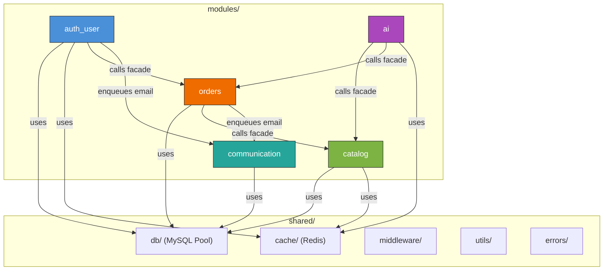

# DHP Store — System Architecture

> **Auto-generated from codebase analysis.** This document is the single source of truth for all AI agents operating in this repository.

---

## 1. Architecture Pattern: Modular Monolith

The Node.js backend (`server/src/`) follows a **Modular Monolith** pattern:

- **5 domain modules** (`auth_user`, `catalog`, `orders`, `communication`, `ai`) in `modules/`.
- **1 shared infrastructure layer** (`shared/`) containing cross-cutting concerns: DB pool, Redis, middleware, queues connection, utilities, and error classes.
- **1 composition root** (`index.js`) that wires modules together, mounts routes, registers Bull Board, and manages graceful shutdown.
- **All cross-module communication** goes through public facades (`modules/*/index.js`). No module may import another module's `repository.js`, `service.js`, or internal files directly.

```
server/src/
├── config.js                    # Env validation (must be imported first)
├── index.js                     # Composition root
├── shared/                      # Cross-cutting infrastructure
│   ├── db/pool.js               # MySQL2 connection pool
│   ├── cache/redis.js           # node-redis client (graceful degradation)
│   ├── middleware/               # csrf, rateLimit, requireAuth, requireRole, upload
│   ├── queues/connection.js     # Shared IORedis BullMQ connection config
│   ├── errors/AppError.js       # Custom error class
│   └── utils/                   # formatImageUrl, generateSku, validatePassword
├── modules/
│   ├── auth_user/               # Authentication, sessions, JWT, OAuth, profiles
│   ├── catalog/                 # Products, variants, inventory, sitemap, cache
│   ├── orders/                  # Cart, orders, checkout, Stripe webhooks
│   ├── communication/           # Feedback, emails, mailer
│   └── ai/                      # AI recommendations, chatbot, model refresh
└── uploads/                     # User-uploaded files (runtime)
```

---

## 2. Frontend Stack

| Layer | Technology | Version / Notes |
|---|---|---|
| **Framework** | React | ^18.3.1 (JSX, no TypeScript currently) |
| **Build Tool** | Vite | ^5.4.0 (`@vitejs/plugin-react`) |
| **Routing** | React Router DOM | ^6.26.1 |
| **State / Data Fetching** | TanStack React Query | ^5.101.4 |
| **HTTP Client** | Axios | ^1.7.4 |
| **Payments** | Stripe (`@stripe/react-stripe-js`, `@stripe/stripe-js`) + PayPal (`@paypal/react-paypal-js`) |
| **Error Tracking** | Sentry (`@sentry/react` ^10.69.0) |
| **Icons** | React Icons ^5.5.0 |
| **Linting** | ESLint ^9 with `eslint-plugin-react`, `react-hooks`, `react-refresh` |
| **Deployment** | Vercel (primary), GitHub Pages (`gh-pages`), Docker (Nginx alpine) |

### Key Frontend Patterns
- **Entry point:** `src/main.jsx` → `src/App.jsx`
- **Directory structure:** `pages/`, `components/`, `context/`, `hooks/`, `styles/`, `assets/`
- **API base:** Centralized in `src/api.js` via Axios instance
- **Custom hooks:** Located in `src/hooks/` (e.g., `useProducts`)
- **Styling:** Vanilla CSS with modular page-level stylesheets + global `styles.css`

---

## 3. Backend Stack

| Layer | Technology | Version / Notes |
|---|---|---|
| **Runtime** | Node.js | ≥16.0.0 (runs on `node:22-alpine` in Docker) |
| **Framework** | Express | ^4.19.2 |
| **Database Driver** | mysql2/promise | ^3.14.3 (connection pool) |
| **Database** | TiDB (MySQL-compatible) | Cloud-hosted, SSL in production |
| **Caching** | Redis | ^5.11.0 (`redis:alpine` in Docker) |
| **Auth** | JWT (`jsonwebtoken` ^9) + bcryptjs ^2.4.3 + HTTP-only cookies (`cookie-parser`) |
| **Payments** | Stripe server SDK (`stripe` ^20.2.0) |
| **File Uploads** | Multer ^2.0.2 |
| **Email** | Nodemailer ^7.0.13 |
| **Security** | Helmet ^8.1.0, CORS (env-driven), `express-rate-limit` ^8.2.1 |
| **Observability** | Sentry (`@sentry/node` ^10.69.0), Morgan (`common` format) |
| **Validation** | validator ^13.15.35 |
| **Linting** | ESLint ^10.7.0 with `@eslint/js` flat config |
| **Dev Tooling** | Nodemon ^3.1.0 |

---

## 4. Module Definitions

Each module is a vertical slice owning its routes, controllers, services, repositories, queues, and workers.

| Module | Domain Responsibility | Owned Database Tables | Key Facade Exports |
|---|---|---|---|
| **`auth_user`** | Authentication, sessions, JWT, OAuth, password management, profile CRUD, user roles | `users`, `refresh_tokens`, `password_resets` | `authRouter` |
| **`catalog`** | Products, categories, variants, colors, sizes, inventory, product images, SKU generation, sitemap, cache invalidation | `products`, `categories`, `product_variants`, `colors`, `sizes`, `inventory`, `product_images`, `inventory_reservations` | `catalogRouter`, `sitemapRouter`, `hydrateProducts`, `getProductsByIds`, `getVariantPrice`, `getProductBasePrice`, `deductInventory`, `restoreInventory`, `getAvailableStock`, `getActiveProductSummaries`, `cacheQueue`, `reservationCleanupQueue`, `scheduleReservationCleanup` |
| **`orders`** | Shopping cart, order lifecycle, checkout, payment intents, Stripe webhooks, order items | `carts`, `cart_items`, `orders`, `order_items` | `ordersRouter`, `cartRouter`, `webhooksRouter`, `stripeQueue`, `cartCleanupQueue`, `scheduleCartCleanup`, `getOrderStatsByUserId`, `getLastPurchasedProductId` |
| **`ai`** | AI recommendation proxy, chat proxy, AI model refresh triggers | None (stateless proxy to Python service) | `recommendRouter`, `chatRouter`, `aiRefreshQueue` |
| **`communication`** | Email transporter, email templates, email sending, user feedback | `feedback` | `emailQueue`, `feedbackRouter` |

---

## 5. Module Dependency Graph



### Allowed Cross-Module Dependencies

| Caller | Callee | Method | Purpose |
|---|---|---|---|
| `auth_user/service.js` | `orders/index.js` | `getOrderStatsByUserId()` | Profile page order statistics |
| `orders/service.js` | `catalog/index.js` | `getVariantPrice()`, `deductInventory()`, `restoreInventory()`, `getAvailableStock()` | Checkout price verification and inventory management |
| `orders/controller.js` | `communication/index.js` | `emailQueue.add()` | Order confirmation emails |
| `auth_user/service.js` | `communication/index.js` | `emailQueue.add()` | Password reset emails |
| `ai/service.js` | `catalog/index.js` | `getProductsByIds()`, `hydrateProducts()` | Recommendation hydration |
| `ai/service.js` | `orders/index.js` | `getLastPurchasedProductId()` | Personalized recommendations |

---

## 6. API Route Mapping

| Route Prefix | Module | Router Export | Description |
|---|---|---|---|
| `/api/auth` | `auth_user` | `authRouter` | Registration, login, profile, JWT, OAuth, password flows |
| `/api/products` | `catalog` | `catalogRouter` | Product CRUD, variants, images, inventory, categories |
| `/api/cart` | `orders` | `cartRouter` | Shopping cart operations |
| `/api/orders` | `orders` | `ordersRouter` | Order management, Stripe checkout |
| `/api/feedback` | `communication` | `feedbackRouter` | User feedback submission |
| `/api/recommend` | `ai` | `recommendRouter` | AI-powered product recommendations |
| `/api/chat` | `ai` | `chatRouter` | AI chatbot (Hybrid RAG) |
| `/api/webhooks/stripe` | `orders` | `webhooksRouter` | Stripe webhook receiver (raw body) |
| `/api/health` | `index.js` (inline) | — | Health check endpoint |
| `/sitemap.xml` | `catalog` | `sitemapRouter` | Dynamic XML sitemap (Redis-cached) |
| `/admin/queues` | `index.js` (Bull Board) | — | BullMQ dashboard (non-production only) |

---

## 7. Worker & Queue Ownership Matrix

| Queue | Queue Location | Worker | Worker Location | Produced By | Domain Owner |
|---|---|---|---|---|---|
| `email` | `communication/queues/` | `emailWorker` | `communication/workers/` | `auth_user`, `orders` | communication |
| `stripe-webhook` | `orders/queues/` | `stripeWorker` | `orders/workers/` | `orders/webhooks.js` | orders |
| `cache-invalidate` | `catalog/queues/` | `cacheWorker` | `catalog/workers/` | `catalog/controller.js` | catalog |
| `ai-refresh` | `ai/queues/` | `aiRefreshWorker` | `ai/workers/` | `ai/routes/recommendations.js` | ai |
| `cart-cleanup` | `orders/queues/` | `cartCleanupWorker` | `orders/workers/` | `index.js` (cron schedule) | orders |
| `reservation-cleanup` | `catalog/queues/` | `reservationCleanupWorker` | `catalog/workers/` | `index.js` (cron schedule) | catalog |

---

## 8. Module Communication Rules

| # | Rule | Enforcement |
|---|---|---|
| 1 | **No cross-module repository imports.** Module A must never import `moduleB/repository.js`. | Code review + ESLint `no-restricted-imports` (future) |
| 2 | **All cross-module calls go through `index.js` facade.** | Each module's `index.js` is the only file other modules may import from. |
| 3 | **No direct SQL to tables owned by another module.** | E.g., `orders/` must not contain `SELECT ... FROM products`. Use catalog facade. |
| 4 | **Shared infrastructure (`shared/`) has no domain logic.** | `shared/` contains only connection pools, middleware, error classes, and generic utilities. |
| 5 | **Workers may use their owning module's repository.** | E.g., `catalog/workers/cacheWorker.js` may use `catalog/repository.js`. |
| 6 | **Queue definitions and workers live with the domain data owner.** | E.g., `reservationCleanupQueue` and `reservationCleanupWorker` live in `catalog/`. |
| 7 | **Transaction connections may be passed as parameters across facades.** | When a checkout transaction spans catalog and orders, the same `conn` is passed. |

---

## 9. AI Service

| Layer | Technology | Notes |
|---|---|---|
| **Runtime** | Python | FastAPI (`main.py`) |
| **Core Logic** | `recommender.py` | Hybrid RAG: Pydantic schemas, Pinecone search, Gemini chat |
| **Vector DB** | Pinecone | Product catalog embeddings (768-dim via `gemini-embedding-2`) |
| **LLM** | Google Gemini | Structured output for intent detection + conversational synthesis |
| **Containerized** | Docker (`Dockerfile`) | Standalone microservice on port `10000` |

---

## 10. Database Transaction Rules (TiDB / MySQL)

- **Driver:** `mysql2/promise` with connection pooling (`shared/db/pool.js`)
- **Pool Configuration:**
  - `connectionLimit: 20` — tuned for production concurrency
  - `queueLimit: 0` — unlimited queuing to prevent request drops
  - `idleTimeout: 60000` — clean up idle connections after 60s
- **SSL:** Enforced in production (`rejectUnauthorized: true`, `minVersion: TLSv1.2`). Optional CA cert via `DB_SSL_CA` env var.
- **Transaction Pattern:** Use `pool.getConnection()` → `conn.beginTransaction()` → `conn.commit()` / `conn.rollback()` → `conn.release()` for multi-step operations. **Never hold connections across async boundaries without explicit release.**
- **Cross-Module Transactions:** The `orders` module passes a `conn` parameter to `catalog` facade functions (`deductInventory`, `restoreInventory`) within a single transaction. This is the only accepted cross-boundary transaction pattern.

---

## 11. Redis Caching Strategy (Graceful Degradation)

```
┌─────────────┐     ┌───────────┐     ┌──────────┐
│   Express   │────▶│   Redis   │────▶│  TiDB    │
│   Server    │     │  (Cache)  │     │  (Source) │
└─────────────┘     └───────────┘     └──────────┘
                         │
                    Falls back to
                    TiDB if Redis
                    is unavailable
```

- **Connection:** Non-blocking `redis.connect()` — the server boots and operates even if Redis is completely down.
- **Reconnection:** Exponential backoff with `retries * 100ms`, capped at `3000ms`, max `10` retries before giving up.
- **Error Handling:** Errors are logged (`Redis error:`, `Redis reconnecting...`) but never crash the process.
- **Design Principle:** Redis is a **performance accelerator, not a hard dependency**. All read paths must have a TiDB fallback.

---

## 12. CI/CD Pipeline

### Docker Multi-Stage Builds

**Frontend (`client/Dockerfile`):**
1. **Stage 1 — Builder:** `node:22-alpine`, `npm ci`, inject `VITE_STRIPE_PUBLIC_KEY` and `VITE_API_URL` as build args, `npm run build`
2. **Stage 2 — Serve:** `nginx:alpine`, copy build artifacts, custom `nginx.conf`, expose port `80`

**Backend (`server/Dockerfile`):**
1. **Stage 1 — Deps:** `node:22-alpine`, `npm ci` (all deps)
2. **Stage 2 — Runner:** `node:22-alpine`, copy deps, `npm prune --production`, create uploads directory, run as non-root `node` user, expose port `5001`

### Docker Compose (`docker-compose.yml`)
Orchestrates 4 services:
1. `frontend` — React app (port 5173→80)
2. `backend` — Express API (port 5001)
3. `ai-service` — Python recommendation engine (port 10000)
4. `redis` — Cache layer (port 6379, persistent volume `redis_data`)

### Versioning
- **Semantic Versioning:** Currently at `v1.1.0`
- **Release Automation:** Release Please via GitHub Actions
- **Conventional Commits:** Strictly enforced (`feat:`, `fix:`, `chore:`, `refactor:`, `docs:`)

### Security Hardening
- **Helmet:** Full CSP directives (script, style, font, img, connect, frame sources)
- **CORS:** Environment-driven allowlist via `CORS_ORIGINS`
- **Rate Limiting:** Global rate limiter via `express-rate-limit`
- **Trust Proxy:** `app.set('trust proxy', 1)` for correct client IP behind reverse proxies
- **JWT Validation:** Warns if secret < 64 chars
- **Required Env Vars:** Fatal exit on missing: `DB_HOST`, `DB_USER`, `DB_PASS`, `DB_NAME`, `JWT_SECRET`, `STRIPE_SECRET_KEY`

---

## 13. Project Historical Phases

| Phase | Focus | Key Commits |
|---|---|---|
| **Phase 1** | Core e-commerce (products, cart, orders, auth, payments) | Initial commits through UI refactors |
| **Phase 2** | Performance optimizations (TanStack Query, Redis caching, Docker refactoring) | `feat: implement useProducts hook and integrate TanStack Query`, `feat: implemented Redis caching layer` |
| **Phase 3** | CI/CD pipeline, production hardening, Sentry observability | `feat: implement phase 2 optimizations and phase 3 ci pipeline`, `feat: integrate Sentry for error tracking` |
| **Phase 4** | UI modularization, responsive layouts, loading states | `refactor: modularize form component`, `feat: implement optimized full-screen video loading screen` |
| **Phase 5** | **Modular Monolith refactoring** — restructured entire backend into `shared/` + `modules/` with strict facade encapsulation, co-located queues/workers, and zero API regressions | 8-phase incremental extraction (Phases 1–8 of refactoring plan) |
