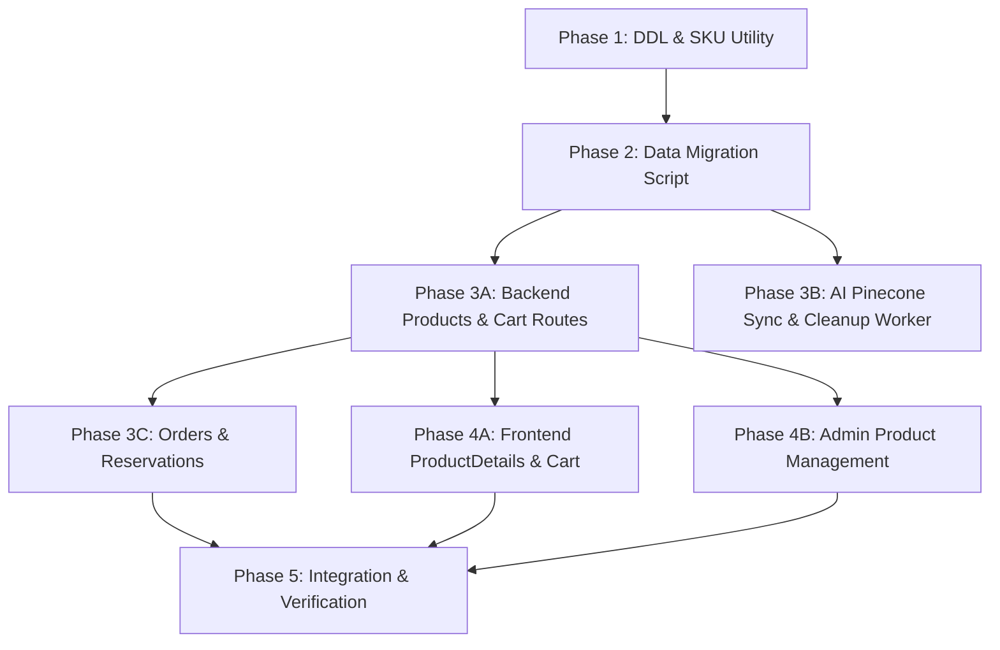

# Implementation Plan — Catalog Schema Enhancement (Product Variant Hierarchy)

Based on the approved [Technical_Specification.md](file:///Users/dohuuphuoc/Dev/e-commercial-project/dhp-store/.agents/production_artifacts/Technical_Specification.md).

## Phase Breakdown

### Phase 1: Data Layer (DDL & SKU Utility) — [COMPLETED]
- **Files created/modified:**
  - `server/migrations/004_catalog_schema_enhance.sql` (Creates `colors`, `sizes`, `product_variants`, `inventory`, `inventory_reservations`, `product_images`, `variant_images`)
  - `server/src/utils/generateSku.js` (Deterministic SKU generator: `{CAT}-{NAME}-{COLOR}-{SIZE}`)
- **Dependencies:** None
- **Estimated Complexity:** Medium
- **Status:** Completed & verified. INT foreign key compatibility fixed for MySQL InnoDB.

### Phase 2: Data Migration Script — [COMPLETED]
- **Files created/modified:**
  - `server/migrations/004_catalog_schema_enhance.js`
- **Dependencies:** `mysql2`, `dotenv`
- **Estimated Complexity:** High
- **Status:** Executed successfully.
  - 10 active products migrated
  - 34 product variants created with auto-generated SKUs
  - 34 inventory records initialized with 50 units each (total 1,700 stock units)
  - 10 primary product images migrated to `product_images`
  - Lookup tables seeded (`colors`, `sizes`)
  - Schema alterations (`products.base_price`, `cart_items.variant_id`, `order_items.variant_id`) applied
  - Foreign keys (`fk_cart_items_variant`, `fk_order_items_variant`) attached
  - Idempotency verified

### Phase 3: Backend API & Service Enhancements
- **Files to modify/create:**
  - `server/src/routes/products.js`:
    - Update `GET /api/products`: Return products with aggregated variant list (`variants[]` including `id`, `sku`, `color`, `size`, `price`, `stock`, `images[]`), price range, total stock.
    - Update `GET /api/products/:id`: Return single product with full variant details and images.
    - Update `POST /api/products`: Accept new nested creation payload (creates product, variants, inventory, and images inside a single ACID transaction).
    - Repurpose `PUT /api/products/:id/stock` to `PUT /api/products/variants/:variantId/inventory` to update `inventory.quantity`.
    - Update `PUT /api/products/:id` to handle base fields and preserve variant integrity.
  - `server/src/routes/cart.js`:
    - Update `POST /api/cart/add`: Accept `variant_id` (or fallback search by product_id + color_id + size_id), check available stock (`quantity - reserved_quantity`), upsert cart item with `variant_id`.
    - Update `POST /api/cart/update`: Accept `variant_id`, validate stock limit.
    - Update `GET /api/cart`: Join `product_variants`, `colors`, `sizes`, `inventory` to return SKU, color, size, effective price, and available stock.
  - `server/src/routes/orders.js`:
    - Update checkout / order creation:
      - Verify stock availability (`inventory.quantity - inventory.reserved_quantity >= item.qty`).
      - Create temporary `inventory_reservations` row with 15-minute expiration, increment `inventory.reserved_quantity`.
      - On payment success: deduct `inventory.quantity`, decrement `inventory.reserved_quantity`, mark reservation `fulfilled`, store `order_items.variant_id`.
      - On payment cancel/failure: decrement `inventory.reserved_quantity`, delete/expire reservation.
  - BullMQ Workers:
    - [NEW] `server/src/workers/reservationCleanupWorker.js`: Background cron running every 2 minutes. Queries `inventory_reservations` where `status = 'active'` AND `expires_at < NOW()`. Decrements `inventory.reserved_quantity`, sets status to `'expired'` in a transaction.
    - Register worker in server queue scheduler / startup.
    - [MODIFY] `server/src/workers/aiRefreshWorker.js`: Fetch variants, colors, sizes, stock, price range for Pinecone sync.
  - AI Microservice:
    - [MODIFY] `ai-service/app/vector_store.py`: Update SQL query in `sync_products_to_pinecone` to query `base_price`, aggregate variants (colors, sizes, min/max price, available stock) for metadata and embedding text.
- **Dependencies:** BullMQ, ioredis
- **Estimated Complexity:** High

### Phase 4: Frontend UI Foundation & Polish
- **Files to modify:**
  - `client/src/pages/ProductDetails.jsx`:
    - Replace flat size buttons with color swatch selection + available size buttons based on selected color.
    - Display selected variant SKU, dynamic price (using `price_override` if set, else `base_price`), and accurate variant stock (`In Stock`, `Low Stock`, `Out of Stock`).
    - Disable 'Add to Cart' when variant stock is 0.
    - Image carousel supporting multiple product and variant images.
  - `client/src/pages/Cart.jsx`:
    - Display selected color, size, and SKU alongside product name.
    - Limit quantity spinner to variant available stock.
  - `client/src/pages/AdminProductManagement.jsx`:
    - Support multi-variant creation (color, size, price override, initial inventory).
    - Multi-image URL inputs.
    - Inventory table to adjust stock per variant directly.
- **Dependencies:** None (uses existing Tailwind/Lucide/Axios/React Router stack)
- **Estimated Complexity:** High

### Phase 5: Integration, Verification & Audit
- **Files to create/modify:**
  - `.agents/production_artifacts/Walkthrough.md`
  - Automated lint checks: `cd client && npm run lint` and `cd server && npm run lint`
  - Manual flow verification of end-to-end variant lifecycle:
    - Admin creates product with 2 colors and 3 sizes
    - User views product, switches color/size, observes price and image changes
    - User adds variant to cart, proceeds to checkout, tests reservation hold
    - Reservation expiration verification
- **Estimated Complexity:** Medium

## Dependency Graph

## Risk Assessment & Mitigations

1. **Risk:** MySQL foreign key type mismatch between existing `INT` columns and new tables.
   - **Mitigation:** Standardized all primary and foreign keys to `INT` across `colors`, `sizes`, `product_variants`, `inventory`, `inventory_reservations`, `product_images`, `variant_images`. Fully verified on live database.
2. **Risk:** Backward compatibility with legacy cart items or orders.
   - **Mitigation:** `cart_items.variant_id` and `order_items.variant_id` are nullable. Existing columns `products.sizes`, `products.stock`, and `products.image_url` are retained during the transition period.
3. **Risk:** Race conditions during checkout leading to overselling.
   - **Mitigation:** Use `SELECT ... FOR UPDATE` on `inventory` records, check `quantity - reserved_quantity >= requested_qty`, record reservation in `inventory_reservations`, and clean up abandoned holds automatically via `reservationCleanupWorker`.
4. **Risk:** Stale Redis cache displaying old monolithic product format.
   - **Mitigation:** Invalidate `products:all`, `products:category:*`, `product:*` keys whenever catalog updates occur.
