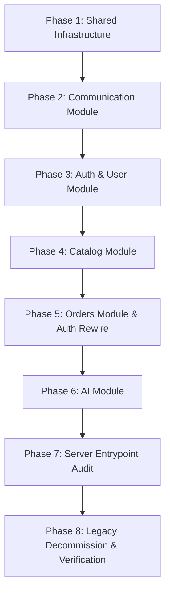

# Implementation Plan — Modular Monolith Architecture Refactoring

Based on the updated and approved [Technical_Specification.md](file:///Users/dohuuphuoc/Dev/e-commercial-project/dhp-store/.agents/production_artifacts/Technical_Specification.md).

## Architectural Strategy & Flaw Remediations

1. **ES Module Safety (No Forward References):** In Phase 3 (`auth_user`), the profile order statistics aggregation temporarily imports `getOrderStatsByUserId` from legacy `../../routes/orders.js`. Once Phase 5 extracts `orders`, this import is rewired to `../orders/index.js`, preventing any ESM `ERR_MODULE_NOT_FOUND` crash.
2. **Queue Domain Boundary Integrity:** `reservationCleanupQueue.js` is moved into `modules/catalog/queues/` directly alongside `reservationCleanupWorker.js` in `modules/catalog/workers/` because they manage `inventory_reservations` and `inventory` tables owned by the `catalog` domain.
3. **Legacy Import Synchronization:** At every single phase, all remaining legacy routes/workers/queues/index files are immediately updated to import from newly created `shared/` utilities or module facades, keeping the codebase runnable and lint-free after every phase.

---

## Phase Breakdown

### Phase 1: Extract `shared/` Infrastructure — [CURRENT]
- **Tasks:**
  - Create directory hierarchy `server/src/shared/`: `db/`, `cache/`, `middleware/`, `queues/`, `utils/`, `errors/`.
  - Move database pool from `server/src/db.js` to `server/src/shared/db/pool.js`.
  - Move Redis client from `server/src/cache/redis.js` to `server/src/shared/cache/redis.js`.
  - Move middleware files from `server/src/middleware/` to `server/src/shared/middleware/` (`csrf.js`, `rateLimit.js`, `requireAuth.js`, `requireRole.js`, `upload.js`).
  - Move shared BullMQ connection from `server/src/queues/connection.js` to `server/src/shared/queues/connection.js`.
  - Move shared utilities from `server/src/utils/` to `server/src/shared/utils/` (`formatImageUrl.js`, `generateSku.js`, `validatePassword.js`).
  - Create custom `AppError` class in `server/src/shared/errors/AppError.js`.
  - Update all legacy import references across `routes/*.js`, `workers/*.js`, `queues/*.js`, `migrations/`, and `index.js`.
- **Verification:** Run `npm run lint` and verify server startup with `node -e "import('./src/index.js')"`.

---

### Phase 2: Extract `communication` Module
- **Tasks:**
  - Split `routes/feedback.js` into `modules/communication/` (`routes.js`, `controller.js`, `service.js`, `repository.js`).
  - Move `queues/emailQueue.js` to `modules/communication/queues/emailQueue.js`.
  - Move `workers/emailWorker.js` to `modules/communication/workers/emailWorker.js`.
  - Move `utils/mailer.js` to `modules/communication/mailer.js`.
  - Create `modules/communication/index.js` exporting `{ emailQueue, feedbackRouter }`.
  - Update legacy imports in `routes/auth.js`, `routes/orders.js`, and `server/src/index.js`.
- **Verification:** Run `npm run lint` and test server boot.

---

### Phase 3: Extract `auth_user` Module
- **Tasks:**
  - Split `routes/auth.js` into `modules/auth_user/` (`routes.js`, `controller.js`, `service.js`, `repository.js`).
  - Create `modules/auth_user/index.js` exporting `{ authRouter }`.
  - Export `getOrderStatsByUserId` in legacy `routes/orders.js`.
  - Import `getOrderStatsByUserId` in `modules/auth_user/service.js` from legacy `../../routes/orders.js` to avoid ESM startup crash.
  - Import `emailQueue` from `../communication/index.js`.
  - Update `server/src/index.js` auth router import.
- **Verification:** Run `npm run lint` and test server boot.

---

### Phase 4: Extract `catalog` Module
- **Tasks:**
  - Split `routes/products.js` into `modules/catalog/` (`routes.js`, `controller.js`, `service.js`, `repository.js`).
  - Move `routes/sitemap.js` to `modules/catalog/sitemap.js`.
  - Move `queues/cacheQueue.js` to `modules/catalog/queues/cacheQueue.js`.
  - Move `queues/reservationCleanupQueue.js` to `modules/catalog/queues/reservationCleanupQueue.js`.
  - Move `workers/cacheWorker.js` to `modules/catalog/workers/cacheWorker.js`.
  - Move `workers/reservationCleanupWorker.js` to `modules/catalog/workers/reservationCleanupWorker.js`.
  - Create `modules/catalog/index.js` exporting `catalogRouter`, `sitemapRouter`, queues, workers, and domain functions (`hydrateProducts`, `getProductsByIds`, `getVariantPrice`, `getProductBasePrice`, `deductInventory`, `restoreInventory`, `getAvailableStock`, `getActiveProductSummaries`).
  - Update legacy imports in `routes/recommendations.js`, `routes/cart.js`, `routes/orders.js`, and `index.js`.
- **Verification:** Run `npm run lint` and test server boot.

---

### Phase 5: Extract `orders` Module
- **Tasks:**
  - Split `routes/orders.js` and `routes/cart.js` into `modules/orders/` (`routes.js`, `controller.js`, `service.js`, `repository.js`).
  - Move `routes/webhooks.js` to `modules/orders/webhooks.js`.
  - Move `queues/stripeQueue.js` to `modules/orders/queues/stripeQueue.js`.
  - Move `queues/cartCleanupQueue.js` to `modules/orders/queues/cartCleanupQueue.js`.
  - Move `workers/stripeWorker.js` to `modules/orders/workers/stripeWorker.js`.
  - Move `workers/cartCleanupWorker.js` to `modules/orders/workers/cartCleanupWorker.js`.
  - Create `modules/orders/index.js` exporting routers, queues, workers, and public functions (`getOrderStatsByUserId`, `getLastPurchasedProductId`).
  - Rewire `modules/auth_user/service.js` to import `getOrderStatsByUserId` from `../orders/index.js` (replacing legacy import).
  - Update `server/src/index.js` to import orders routers, queues, workers from `modules/orders/`.
- **Verification:** Run `npm run lint` and test server boot.

---

### Phase 6: Extract `ai` Module
- **Tasks:**
  - Split `routes/recommendations.js` and `routes/chat.js` into `modules/ai/` (`routes/`, `service.js`).
  - Move `queues/aiRefreshQueue.js` to `modules/ai/queues/aiRefreshQueue.js`.
  - Move `workers/aiRefreshWorker.js` to `modules/ai/workers/aiRefreshWorker.js`.
  - Create `modules/ai/index.js` exporting `recommendRouter`, `chatRouter`, `aiRefreshQueue`, `aiRefreshWorker`.
  - Use catalog and orders facades in `modules/ai/service.js`.
  - Update `server/src/index.js` AI imports.
- **Verification:** Run `npm run lint` and test server boot.

---

### Phase 7: Server Entrypoint Final Rewire & Audit
- **Tasks:**
  - Audit `server/src/index.js` to guarantee 100% of dependencies come from `shared/` or `modules/*/index.js`.
  - Confirm route mounts, error handling, Bull Board setup, and graceful shutdown are intact.
- **Verification:** Run `npm run lint` and test server boot.

---

### Phase 8: Legacy Decommissioning & Full Verification
- **Tasks:**
  - Delete legacy empty directories: `routes/`, `queues/`, `workers/`, `utils/`, `cache/`, `middleware/`, and root `db.js`.
  - Verify complete test suite and API checklist.
  - Produce final `Walkthrough.md`.
- **Verification:** Clean `git status`, `npm run lint` with 0 errors.

---

## Dependency Graph

