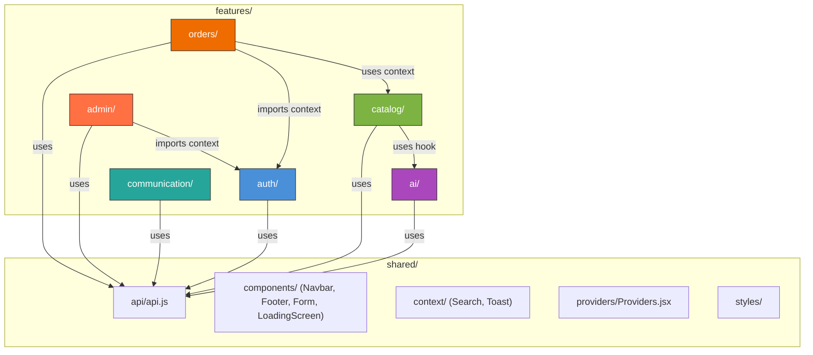

# Technical Specification: Vite/React → Next.js (App Router) Migration with Bulletproof React Architecture

> **Scope:** 100% structural & architectural. Zero UI/UX/CSS changes.
> **Generated:** 2026-09-15 — Based on exhaustive audit of `dhp-store/client/src/`

---

## Phase 1 — Codebase Audit

### 1.1 Current Frontend Inventory

#### Entry Points

| File | Role |
|---|---|
| `index.html` | SPA shell, loads Google Identity Services script, preloads `loading-screen.webm` |
| `src/main.jsx` | React root: `Sentry.init`, `QueryClient`, `HelmetProvider`, `BrowserRouter`/`HashRouter` conditional |
| `src/App.jsx` | Route definitions, provider nesting, lazy-loaded pages, global layout (Navbar + Footer + ChatBot) |
| `src/api.js` | Axios instance with `VITE_API_URL`, CSRF header, 401 silent-refresh interceptor |

#### Pages (20 files in `src/pages/`)

| Page Component | Route(s) | Backend Domain | Helmet Usage | Key Dependencies |
|---|---|---|---|---|
| `Home.jsx` | `/`, (empty) | catalog, ai | ✅ title, meta, OG, JSON-LD | `useProducts`, `useSearch`, `useCart`, `useAuth`, `CartDrawer` |
| `Products.jsx` | `/products` | catalog, ai | ✅ title, meta, OG | `useProducts`, `useUserRecommendations`, `useSearch`, `RecommendRow` |
| `ProductDetails.jsx` | `/product/:id` | catalog, ai | ✅ title, meta, OG, JSON-LD (Product) | `useProduct`, `useProductRecommendations`, `useCart`, `RecommendRow` |
| `Login.jsx` | `/login` | auth | ✅ title | `useAuth`, `GoogleLoginButton`, `Form`, `api` (forgot-password) |
| `Account.jsx` | `/account` | auth, orders | ❌ | `useAuth`, `api` (profile, orders, password, upload) |
| `Checkout.jsx` | `/checkout` | orders | ❌ | `useCart`, `useAuth`, `api`, Stripe Elements, PayPal Buttons |
| `Cart.jsx` | `/cart` | orders | ❌ | `CartDrawer` (wrapper only) |
| `About.jsx` | `/about` | — (static) | ✅ title, meta, OG | Static assets only |
| `Contact.jsx` | `/contacts` | — (static) | ❌ | `react-icons/fa`, static showroom data |
| `Feedback.jsx` | `/feedback` | communication | ❌ | `api` (feedback), `Form` |
| `ResetPassword.jsx` | `/reset-password` | auth | ❌ | `api`, `useSearchParams` |
| `NotFound.jsx` | `*` | — | ❌ | `Link` only |
| `admin/AdminLayout.jsx` | `/admin` | — | ❌ | `Outlet`, `Link`, `import.meta.env` |
| `admin/AdminDashboard.jsx` | `/admin` (index) | — | ❌ | `useAuth` |
| `admin/ManageOrders.jsx` | `/admin/orders` | orders | ❌ | `api` |
| `admin/ManageProducts.jsx` | `/admin/products` | catalog | ❌ | `api` |

#### Components (13 files in `src/components/`)

| Component | Backend Domain | Used By |
|---|---|---|
| `Navbar.jsx` | — (layout) | `App.jsx` (global) |
| `Footer.jsx` | — (layout) | `App.jsx` (global) |
| `ChatBot.jsx` | ai | `App.jsx` (global) |
| `CartDrawer.jsx` | orders | Home, Products, ProductDetails, Cart |
| `LoadingScreen.jsx` | — (UI) | `App.jsx` (Suspense fallback), `AuthContext` |
| `ProtectedRoute.jsx` | auth | `App.jsx` (admin routes) |
| `RecommendRow.jsx` | ai/catalog | Products, ProductDetails |
| `Form.jsx` | — (UI) | Login, Feedback |
| `GoogleLoginButton.jsx` | auth | Login |
| `CartDrawer.css` | — | CartDrawer |
| `ChatBot.css` | — | ChatBot |
| `LoadingScreen.css` | — | LoadingScreen |
| `Toast.css` | — | ToastContext |

#### Contexts (4 files in `src/context/`)

| Context | Backend Domain | Consumers |
|---|---|---|
| `AuthContext.jsx` | auth | Navbar, Home, Products, ProductDetails, Account, Checkout, AdminDashboard, ProtectedRoute |
| `CartContext.jsx` | orders | Navbar, Home, Products, ProductDetails, Cart, CartDrawer, Checkout |
| `SearchContext.jsx` | — (UI state) | Navbar, Home, Products |
| `ToastContext.jsx` | — (UI) | Available globally, used for notifications |

#### Hooks (1 file in `src/hooks/`)

| Hook | Backend Domain | TanStack Query Keys |
|---|---|---|
| `useProducts(params)` | catalog | `['products', q, categoryId]` |
| `useProduct(id)` | catalog | `['product', id]` |
| `useProductRecommendations(id)` | ai | `['recommendations', 'product', id]` |
| `useUserRecommendations(isAuth)` | ai | `['recommendations', 'user']` |

#### Styles (7 files)

| File | Scope |
|---|---|
| `styles/variables.css` | CSS custom properties (design tokens) |
| `styles/reset.css` | CSS reset |
| `styles/typography.css` | Font declarations |
| `styles/main.css` | Import hub for the above 3 |
| `styles/layout.css` | Grid, container, navbar, footer layouts |
| `styles/components.css` | Cards, buttons, badges, skeleton loaders |
| `styles.css` | Legacy global styles |

Page-level CSS: `Home.css`, `About.css`, `Account.css`, `Checkout.css`, `Contact.css`, `Feedback.css`, `Login.css`, `ProductDetails.css`

---

### 1.2 Domain Mapping: Current → Bulletproof Features

Based on the backend's 5 modules (`auth_user`, `catalog`, `orders`, `communication`, `ai`), each frontend file maps to a domain:

| Domain Feature | Pages | Components | Hooks | Contexts | Page CSS |
|---|---|---|---|---|---|
| **`auth`** | `Login.jsx`, `ResetPassword.jsx`, `Account.jsx` | `GoogleLoginButton.jsx`, `ProtectedRoute.jsx` | — | `AuthContext.jsx` | `Login.css`, `Account.css` |
| **`catalog`** | `Products.jsx`, `ProductDetails.jsx` | — | `useProducts`, `useProduct` | — | `ProductDetails.css` |
| **`orders`** | `Cart.jsx`, `Checkout.jsx` | `CartDrawer.jsx`, `CartDrawer.css` | — | `CartContext.jsx` | `Checkout.css` |
| **`ai`** | — | `ChatBot.jsx`, `ChatBot.css`, `RecommendRow.jsx` | `useProductRecommendations`, `useUserRecommendations` | — | — |
| **`communication`** | `Feedback.jsx` | — | — | — | `Feedback.css` |
| **`admin`** | `admin/AdminLayout.jsx`, `admin/AdminDashboard.jsx`, `admin/ManageOrders.jsx`, `admin/ManageProducts.jsx` | — | — | — | — |
| **`shared` (UI)** | `Home.jsx`, `About.jsx`, `Contact.jsx`, `NotFound.jsx` | `Navbar.jsx`, `Footer.jsx`, `Form.jsx`, `LoadingScreen.jsx`, `LoadingScreen.css`, `Toast.css` | — | `SearchContext.jsx`, `ToastContext.jsx` | `Home.css`, `About.css`, `Contact.css` |

---

### 1.3 Migration Impact Assessment

#### Routing (`react-router-dom` → Next.js App Router)

| Current Pattern | Impact | Migration Path |
|---|---|---|
| `<BrowserRouter>` / `<HashRouter>` conditional | 🔴 **Remove entirely** | Next.js file-based router replaces this. GitHub Pages deployment (HashRouter) is no longer needed with Next.js on Vercel. |
| `<Routes>` + `<Route>` declarations in `App.jsx` | 🔴 **Remove entirely** | Replaced by `app/` directory file conventions |
| `useNavigate()` | 🟡 **Replace all** | → `useRouter()` from `next/navigation` |
| `useParams()` | 🟡 **Replace all** | → `params` prop in page components or `useParams()` from `next/navigation` |
| `useSearchParams()` | 🟢 **Minimal change** | → `useSearchParams()` from `next/navigation` (near-identical API) |
| `useLocation()` | 🟡 **Replace** | → `usePathname()` + `useSearchParams()` from `next/navigation` |
| `<Link to="...">` | 🟡 **Replace all** | → `<Link href="...">` from `next/link` |
| `<Navigate to="..." replace />` | 🟡 **Replace** | → `redirect()` from `next/navigation` |
| `<Outlet />` (admin layout) | 🟢 **Native in Next.js** | → `{children}` in `layout.jsx` |
| `React.lazy()` + `<Suspense>` | 🟢 **Remove** | Next.js handles code-splitting automatically |

#### SEO (`react-helmet-async` → `generateMetadata`)

| Current Helmet Usage | Target Replacement |
|---|---|
| `<Helmet><title>` on Home, About, Products, ProductDetails, Login | `export const metadata` (static) or `export async function generateMetadata()` (dynamic) in each `page.jsx` |
| `<meta name="description">` | `metadata.description` |
| `<meta property="og:*">` | `metadata.openGraph` |
| `<script type="application/ld+json">` (JSON-LD) on Home, ProductDetails | Move to a `<script>` in the page component or use `metadata.other` |
| `<HelmetProvider>` wrapping entire app | 🔴 **Remove entirely** |

#### State Management (TanStack Query + Context API)

| Current Pattern | Impact | Migration Strategy |
|---|---|---|
| `QueryClient` instantiated in `main.jsx` | 🟡 **Relocate** | Move to a `QueryProvider` client component used in root `layout.jsx` |
| `QueryClientProvider` wrapping app | 🟡 **Relocate** | Wrap in a `"use client"` Providers component |
| `useQuery` hooks (`useProducts`, `useProduct`, etc.) | 🟢 **No change** | Continue to work in Client Components |
| `AuthContext` (checks auth on load, provides login/logout) | 🟡 **Must be `"use client"`** | Wrap in client boundary; remains a context provider |
| `CartContext` (manages cart state, localStorage, API calls) | 🟡 **Must be `"use client"`** | Wrap in client boundary; remains a context provider |
| `SearchContext` (search term, show/hide toggle) | 🟢 **Must be `"use client"`** | Trivial client-only state |
| `ToastContext` (toast notifications) | 🟢 **Must be `"use client"`** | Trivial client-only state |

#### Environment Variables

| Current (`VITE_*`) | Next.js Replacement | Scope |
|---|---|---|
| `VITE_API_URL` | `NEXT_PUBLIC_API_URL` | Client-side (public) |
| `VITE_STRIPE_PUBLIC_KEY` | `NEXT_PUBLIC_STRIPE_PUBLIC_KEY` | Client-side (public) |
| `VITE_SENTRY_DSN` | `NEXT_PUBLIC_SENTRY_DSN` | Client-side (public) |
| `VITE_GOOGLE_CLIENT_ID` | `NEXT_PUBLIC_GOOGLE_CLIENT_ID` | Client-side (public) |
| `import.meta.env.DEV` | `process.env.NODE_ENV === 'development'` | Both |

---

## Phase 2 — Technical Specification

### 2.1 Target Directory Structure

```
client/
├── next.config.mjs              # Next.js configuration (API rewrites, images)
├── package.json                  # Updated dependencies
├── .env.local                    # NEXT_PUBLIC_* env vars
├── public/                       # Static assets (favicon, loading-screen.webm)
│   ├── icon2.png
│   └── loading-screen.webm
│
└── src/
    ├── app/                      # ═══ Next.js App Router (routing only) ═══
    │   ├── layout.jsx            # Root layout: <html>, <head>, global CSS, Providers
    │   ├── loading.jsx           # Root loading UI (LoadingScreen)
    │   ├── not-found.jsx         # 404 page
    │   ├── page.jsx              # "/" → imports Home feature
    │   │
    │   ├── about/
    │   │   └── page.jsx          # "/about" → imports About feature
    │   ├── products/
    │   │   └── page.jsx          # "/products" → imports Products feature
    │   ├── product/
    │   │   └── [id]/
    │   │       └── page.jsx      # "/product/:id" → imports ProductDetails feature
    │   ├── login/
    │   │   └── page.jsx          # "/login" → imports Login feature
    │   ├── cart/
    │   │   └── page.jsx          # "/cart" → imports Cart feature
    │   ├── checkout/
    │   │   └── page.jsx          # "/checkout" → imports Checkout feature
    │   ├── account/
    │   │   └── page.jsx          # "/account" → imports Account feature
    │   ├── contacts/
    │   │   └── page.jsx          # "/contacts" → imports Contact feature
    │   ├── feedback/
    │   │   └── page.jsx          # "/feedback" → imports Feedback feature
    │   ├── reset-password/
    │   │   └── page.jsx          # "/reset-password" → imports ResetPassword feature
    │   │
    │   └── admin/
    │       ├── layout.jsx        # Admin layout with sidebar (ProtectedRoute logic)
    │       ├── page.jsx          # "/admin" → imports AdminDashboard
    │       ├── orders/
    │       │   └── page.jsx      # "/admin/orders" → imports ManageOrders
    │       └── products/
    │           └── page.jsx      # "/admin/products" → imports ManageProducts
    │
    ├── features/                 # ═══ Bulletproof Feature Modules ═══
    │   │
    │   ├── auth/                 # ══ Auth Domain ══
    │   │   ├── components/
    │   │   │   ├── GoogleLoginButton.jsx
    │   │   │   └── ProtectedRoute.jsx
    │   │   ├── context/
    │   │   │   └── AuthContext.jsx
    │   │   ├── pages/
    │   │   │   ├── LoginPage.jsx
    │   │   │   ├── Login.css
    │   │   │   ├── AccountPage.jsx
    │   │   │   ├── Account.css
    │   │   │   └── ResetPasswordPage.jsx
    │   │   └── index.js          # Public barrel export
    │   │
    │   ├── catalog/              # ══ Catalog Domain ══
    │   │   ├── hooks/
    │   │   │   └── useProducts.js
    │   │   ├── pages/
    │   │   │   ├── ProductsPage.jsx
    │   │   │   ├── ProductDetailsPage.jsx
    │   │   │   └── ProductDetails.css
    │   │   └── index.js
    │   │
    │   ├── orders/               # ══ Orders Domain ══
    │   │   ├── components/
    │   │   │   ├── CartDrawer.jsx
    │   │   │   └── CartDrawer.css
    │   │   ├── context/
    │   │   │   └── CartContext.jsx
    │   │   ├── pages/
    │   │   │   ├── CartPage.jsx
    │   │   │   ├── CheckoutPage.jsx
    │   │   │   └── Checkout.css
    │   │   └── index.js
    │   │
    │   ├── ai/                   # ══ AI Domain ══
    │   │   ├── components/
    │   │   │   ├── ChatBot.jsx
    │   │   │   ├── ChatBot.css
    │   │   │   └── RecommendRow.jsx
    │   │   ├── hooks/
    │   │   │   └── useRecommendations.js
    │   │   └── index.js
    │   │
    │   ├── communication/        # ══ Communication Domain ══
    │   │   ├── pages/
    │   │   │   ├── FeedbackPage.jsx
    │   │   │   └── Feedback.css
    │   │   └── index.js
    │   │
    │   └── admin/                # ══ Admin Domain ══
    │       ├── components/
    │       │   └── AdminSidebar.jsx   # Extracted from AdminLayout
    │       ├── pages/
    │       │   ├── AdminDashboard.jsx
    │       │   ├── ManageOrders.jsx
    │       │   └── ManageProducts.jsx
    │       └── index.js
    │
    ├── shared/                   # ═══ Shared / Cross-Cutting ═══
    │   ├── api/
    │   │   └── api.js            # Axios instance (NEXT_PUBLIC_API_URL)
    │   ├── components/
    │   │   ├── Navbar.jsx
    │   │   ├── Footer.jsx
    │   │   ├── Form.jsx
    │   │   ├── LoadingScreen.jsx
    │   │   └── LoadingScreen.css
    │   ├── context/
    │   │   ├── SearchContext.jsx
    │   │   └── ToastContext.jsx
    │   ├── pages/
    │   │   ├── HomePage.jsx
    │   │   ├── Home.css
    │   │   ├── AboutPage.jsx
    │   │   ├── About.css
    │   │   ├── ContactPage.jsx
    │   │   └── Contact.css
    │   ├── providers/
    │   │   └── Providers.jsx     # [NEW] Client-side provider composition
    │   └── styles/
    │       ├── variables.css
    │       ├── reset.css
    │       ├── typography.css
    │       ├── main.css
    │       ├── layout.css
    │       ├── components.css
    │       ├── Toast.css
    │       └── globals.css       # Renamed from styles.css
    │
    └── assets/                   # ═══ Static Assets ═══
        ├── about-image.jpeg
        ├── about2.jpg
        ├── account_icon.png
        ├── home-banner1.png
        ├── home-banner3.jpg
        ├── logo.png
        ├── search_icon.png
        └── shopping_bag.png
```

### 2.2 Rendering Strategy: Client vs. Server Components

> [!IMPORTANT]
> Since this app uses **client-side auth** (JWT cookies), **TanStack Query**, and **Context API** extensively, the vast majority of components will remain **Client Components** (`"use client"`). We are NOT attempting to convert existing pages to Server Components. The migration preserves the existing client-side rendering model within the Next.js framework.

#### Component Classification

| Layer | Rendering | Rationale |
|---|---|---|
| `app/layout.jsx` | **Server Component** | Static HTML shell, imports `Providers` client boundary |
| `app/*/page.jsx` (routing stubs) | **Server Component** | Contains only `metadata` export + renders the feature page component |
| `app/loading.jsx` | **Server Component** | Renders `LoadingScreen` (will be wrapped with `"use client"`) |
| `shared/providers/Providers.jsx` | **Client Component** (`"use client"`) | Wraps `QueryClientProvider`, `AuthProvider`, `CartProvider`, `SearchProvider`, `ToastProvider` |
| All feature `pages/*.jsx` | **Client Component** (`"use client"`) | Use hooks, state, effects, browser APIs |
| All feature `components/*.jsx` | **Client Component** (`"use client"`) | Use hooks, events, browser APIs |
| All feature `context/*.jsx` | **Client Component** (`"use client"`) | `createContext`, `useState`, `useEffect` |
| All feature `hooks/*.js` | **Client-only** | `useQuery`, `useContext` |

#### TanStack Query + Next.js App Router Strategy

```jsx
// src/shared/providers/Providers.jsx
"use client";

import { useState } from 'react';
import { QueryClient, QueryClientProvider } from '@tanstack/react-query';
import { AuthProvider } from '@/features/auth/context/AuthContext';
import CartProvider from '@/features/orders/context/CartContext';
import { SearchProvider } from '@/shared/context/SearchContext';
import { ToastProvider } from '@/shared/context/ToastContext';

export default function Providers({ children }) {
  // useState ensures one QueryClient per browser session (not per render)
  const [queryClient] = useState(() => new QueryClient({
    defaultOptions: {
      queries: {
        staleTime: 5 * 60 * 1000,
        retry: 1,
        refetchOnWindowFocus: true,
      },
    },
  }));

  return (
    <QueryClientProvider client={queryClient}>
      <AuthProvider>
        <CartProvider>
          <SearchProvider>
            <ToastProvider>
              {children}
            </ToastProvider>
          </SearchProvider>
        </CartProvider>
      </AuthProvider>
    </QueryClientProvider>
  );
}
```

```jsx
// src/app/layout.jsx  (Server Component — no "use client")
import Providers from '@/shared/providers/Providers';
import Navbar from '@/shared/components/Navbar';
import Footer from '@/shared/components/Footer';
import ChatBot from '@/features/ai/components/ChatBot';
import '@/shared/styles/main.css';
import '@/shared/styles/layout.css';
import '@/shared/styles/components.css';
import '@/shared/styles/globals.css';

export const metadata = {
  title: { default: 'DHP | Streetwear', template: '%s | DHP Streetwear' },
  description: 'DHP Streetwear — Premium Vietnamese street fashion.',
  openGraph: {
    title: 'DHP Streetwear — Premium Street Fashion',
    description: 'Premium Vietnamese street fashion.',
    type: 'website',
    url: 'https://e-commercial-project-mauve.vercel.app',
  },
};

export default function RootLayout({ children }) {
  return (
    <html lang="en">
      <head>
        <link rel="icon" type="image/png" href="/icon2.png" />
        <link rel="preload" href="/loading-screen.webm" as="video" type="video/webm" />
        <script src="https://accounts.google.com/gsi/client?hl=en" async defer />
      </head>
      <body>
        <Providers>
          <Navbar />
          <ChatBot />
          <main className="container">
            {children}
          </main>
          <Footer />
        </Providers>
      </body>
    </html>
  );
}
```

### 2.3 SEO Strategy: `react-helmet-async` → `generateMetadata()`

#### Static Pages

```jsx
// src/app/about/page.jsx
import AboutPage from '@/shared/pages/AboutPage';

export const metadata = {
  title: 'About Us',
  description: 'Learn about DHP Streetwear — driven by passion, inspired by culture.',
  openGraph: {
    title: 'About Us — DHP Streetwear',
    description: 'Driven by passion. Inspired by culture. Designed for everyone.',
  },
};

export default function Page() {
  return <AboutPage />;
}
```

#### Dynamic Pages (Product Details)

```jsx
// src/app/product/[id]/page.jsx
import ProductDetailsPage from '@/features/catalog/pages/ProductDetailsPage';

// NOTE: generateMetadata runs on the server. Since the backend API requires
// no auth for product reads, we can fetch product data server-side for SEO.
export async function generateMetadata({ params }) {
  const { id } = await params;
  try {
    const res = await fetch(
      `${process.env.NEXT_PUBLIC_API_URL}/products/${id}`,
      { next: { revalidate: 300 } }  // cache for 5 minutes
    );
    const product = await res.json();
    return {
      title: product.name,
      description: product.description || `Shop ${product.name} at DHP Streetwear.`,
      openGraph: {
        title: `${product.name} — DHP Streetwear`,
        description: product.description || `Shop ${product.name} at DHP Streetwear.`,
        type: 'article',
        images: [product.primary_image || product.image_url],
        url: `https://e-commercial-project-mauve.vercel.app/product/${id}`,
      },
    };
  } catch {
    return { title: 'Product | DHP Streetwear' };
  }
}

export default function Page() {
  return <ProductDetailsPage />;
}
```

#### JSON-LD Structured Data

JSON-LD will move from `<Helmet>` to inline `<script>` tags within the Client Component's JSX. Since Next.js renders the component tree to HTML, the JSON-LD will still be present in the initial HTML for crawlers.

```jsx
// Inside ProductDetailsPage.jsx (client component)
// The existing <script type="application/ld+json"> stays in the JSX.
// Remove only the <Helmet> wrapper around it.
```

### 2.4 next.config.mjs — API Proxy & Image Domains

```js
// next.config.mjs
/** @type {import('next').NextConfig} */
const nextConfig = {
  // Replicate Vite dev proxy behavior
  async rewrites() {
    return [
      { source: '/api/:path*', destination: 'http://localhost:5001/api/:path*' },
      { source: '/uploads/:path*', destination: 'http://localhost:5001/uploads/:path*' },
    ];
  },

  images: {
    remotePatterns: [
      { protocol: 'https', hostname: 'cdn.dhpstore.studio' },
      { protocol: 'http', hostname: 'localhost', port: '5001' },
    ],
  },
};

export default nextConfig;
```

### 2.5 Feature Module Rules (Mirroring Backend)

| Rule | Enforcement |
|---|---|
| Feature modules may import from `shared/` freely | Convention |
| Feature modules may import only the barrel `index.js` of other features | Convention + code review |
| `app/` route files import only from `features/*/index.js` or `features/*/pages/*` | Convention |
| No domain logic in `shared/` — only generic UI, utilities, and providers | Convention |
| Each feature `index.js` is the public API facade (mirrors backend `modules/*/index.js`) | Convention |

### 2.6 Cross-Feature Dependency Map (Frontend)



> [!NOTE]
> **Allowed cross-feature imports (matching backend):**
> - `catalog/pages/*` may import `ai/hooks/useRecommendations` (product-based and user-based recommendations)
> - `orders/context/CartContext` may import `auth/context/AuthContext` (to check auth state for server vs. local cart)
> - `admin/pages/*` may import `auth/context/AuthContext` (role checking)
> - `admin/layout.jsx` uses `auth/components/ProtectedRoute` logic

---

## Phase 3 — Step-by-Step Implementation Plan

### Step 1: Next.js Initialization & Configuration

**Goal:** Replace Vite build tooling with Next.js while keeping all source files intact.

1. From `dhp-store/`, create a new Next.js app in a fresh directory:
   ```bash
   npx -y create-next-app@latest client-next --js --app --no-tailwind --no-src-dir --eslint --import-alias "@/*"
   ```
   > We'll use `--no-src-dir` then manually create the `src/` structure, OR use `--src-dir` depending on the template.

2. **Alternatively** (recommended to minimize disruption): Initialize Next.js **in-place** inside the existing `client/` directory:
   - Install Next.js packages:
     ```bash
     cd client
     npm install next@latest react@latest react-dom@latest
     ```
   - Add `next.config.mjs` (see §2.4)
   - Update `package.json` scripts:
     ```json
     {
       "scripts": {
         "dev": "next dev",
         "build": "next build",
         "start": "next start",
         "lint": "next lint"
       }
     }
     ```
   - Create `.env.local` from `.env`, renaming `VITE_*` → `NEXT_PUBLIC_*`
   - Add `src/app/layout.jsx` and `src/app/page.jsx` as the new entry points

3. **Remove Vite-specific files:**
   - Delete `vite.config.js`
   - Remove `@vitejs/plugin-react` from devDependencies
   - Remove `index.html` (Next.js generates its own)
   - Remove `src/main.jsx` (replaced by `app/layout.jsx`)

4. **Update `.gitignore`** for Next.js:
   ```
   .next/
   out/
   ```

5. **Configure path aliases** in `jsconfig.json` (or `tsconfig.json`):
   ```json
   {
     "compilerOptions": {
       "baseUrl": ".",
       "paths": {
         "@/*": ["./src/*"]
       }
     }
   }
   ```

---

### Step 2: Global Providers & Layout Setup

**Goal:** Establish the root layout with all providers, matching the current provider nesting order.

1. **Create `src/shared/providers/Providers.jsx`** — See §2.2 for implementation. This is the single `"use client"` boundary that wraps all context providers + `QueryClientProvider`.

2. **Create `src/app/layout.jsx`** — See §2.2 for implementation. This is the root Server Component that:
   - Sets `<html lang="en">`
   - Defines default `metadata` export (replaces `index.html` meta tags)
   - Imports global CSS files
   - Loads Google Identity Services `<script>` tag
   - Renders `<Providers>`, `<Navbar>`, `<ChatBot>`, `<main>`, `<Footer>`

3. **Create `src/app/loading.jsx`** — Renders `<LoadingScreen />` as the global Suspense fallback.

4. **Move `api.js`** to `src/shared/api/api.js`:
   - Replace `import.meta.env.VITE_API_URL` → `process.env.NEXT_PUBLIC_API_URL`
   - Replace `import.meta.env.DEV` → `process.env.NODE_ENV === 'development'`

5. **Update Sentry init** — Move from `main.jsx` to `src/app/layout.jsx` or a dedicated `src/shared/lib/sentry.js` client module. Use `@sentry/nextjs` instead of `@sentry/react`:
   ```bash
   npm install @sentry/nextjs
   npx @sentry/wizard@latest -i nextjs
   ```

---

### Step 3: Refactoring to `features/` Directory Structure

**Goal:** Reorganize flat `pages/`, `components/`, `hooks/`, `context/` into domain-aligned feature modules.

> [!WARNING]
> **Zero visual changes.** Only file moves and import path updates. Every JSX, CSS class, and inline style stays identical.

#### 3a. Create feature directories

```bash
mkdir -p src/features/{auth,catalog,orders,ai,communication,admin}/{components,pages,hooks,context}
mkdir -p src/shared/{api,components,context,providers,styles,pages}
```

#### 3b. Move files (domain-by-domain)

**Auth feature:**
| Source | Destination |
|---|---|
| `context/AuthContext.jsx` | `features/auth/context/AuthContext.jsx` |
| `components/GoogleLoginButton.jsx` | `features/auth/components/GoogleLoginButton.jsx` |
| `components/ProtectedRoute.jsx` | `features/auth/components/ProtectedRoute.jsx` |
| `pages/Login.jsx` + `pages/Login.css` | `features/auth/pages/LoginPage.jsx` + `Login.css` |
| `pages/Account.jsx` + `pages/Account.css` | `features/auth/pages/AccountPage.jsx` + `Account.css` |
| `pages/ResetPassword.jsx` | `features/auth/pages/ResetPasswordPage.jsx` |

**Catalog feature:**
| Source | Destination |
|---|---|
| `hooks/useProducts.js` (product hooks only) | `features/catalog/hooks/useProducts.js` |
| `pages/Products.jsx` | `features/catalog/pages/ProductsPage.jsx` |
| `pages/ProductDetails.jsx` + `pages/ProductDetails.css` | `features/catalog/pages/ProductDetailsPage.jsx` + `ProductDetails.css` |

**Orders feature:**
| Source | Destination |
|---|---|
| `context/CartContext.jsx` | `features/orders/context/CartContext.jsx` |
| `components/CartDrawer.jsx` + `components/CartDrawer.css` | `features/orders/components/CartDrawer.jsx` + `CartDrawer.css` |
| `pages/Cart.jsx` | `features/orders/pages/CartPage.jsx` |
| `pages/Checkout.jsx` + `pages/Checkout.css` | `features/orders/pages/CheckoutPage.jsx` + `Checkout.css` |

**AI feature:**
| Source | Destination |
|---|---|
| `hooks/useProducts.js` (recommendation hooks) | `features/ai/hooks/useRecommendations.js` |
| `components/ChatBot.jsx` + `components/ChatBot.css` | `features/ai/components/ChatBot.jsx` + `ChatBot.css` |
| `components/RecommendRow.jsx` | `features/ai/components/RecommendRow.jsx` |

**Communication feature:**
| Source | Destination |
|---|---|
| `pages/Feedback.jsx` + `pages/Feedback.css` | `features/communication/pages/FeedbackPage.jsx` + `Feedback.css` |

**Admin feature:**
| Source | Destination |
|---|---|
| `pages/admin/AdminLayout.jsx` | `features/admin/components/AdminSidebar.jsx` (extract sidebar) |
| `pages/admin/AdminDashboard.jsx` | `features/admin/pages/AdminDashboard.jsx` |
| `pages/admin/ManageOrders.jsx` | `features/admin/pages/ManageOrders.jsx` |
| `pages/admin/ManageProducts.jsx` | `features/admin/pages/ManageProducts.jsx` |

**Shared:**
| Source | Destination |
|---|---|
| `api.js` | `shared/api/api.js` |
| `components/Navbar.jsx` | `shared/components/Navbar.jsx` |
| `components/Footer.jsx` | `shared/components/Footer.jsx` |
| `components/Form.jsx` | `shared/components/Form.jsx` |
| `components/LoadingScreen.jsx` + `.css` | `shared/components/LoadingScreen.jsx` + `.css` |
| `components/Toast.css` | `shared/styles/Toast.css` (imported by `ToastContext`) |
| `context/SearchContext.jsx` | `shared/context/SearchContext.jsx` |
| `context/ToastContext.jsx` | `shared/context/ToastContext.jsx` |
| `styles/*` | `shared/styles/*` |
| `styles.css` | `shared/styles/globals.css` |

**Static pages (no backend domain):**
| Source | Destination |
|---|---|
| `pages/Home.jsx` + `pages/Home.css` | `shared/pages/HomePage.jsx` + `Home.css` |
| `pages/About.jsx` + `pages/About.css` | `shared/pages/AboutPage.jsx` + `About.css` |
| `pages/Contact.jsx` + `pages/Contact.css` | `shared/pages/ContactPage.jsx` + `Contact.css` |
| `pages/NotFound.jsx` | `app/not-found.jsx` (Next.js convention) |

#### 3c. Update all import paths

After moving, systematically update all `import` statements. Use the `@/` alias:
- `import { useAuth } from '../context/AuthContext'` → `import { useAuth } from '@/features/auth/context/AuthContext'`
- `import api from '../api'` → `import api from '@/shared/api/api'`
- `import { useNavigate } from 'react-router-dom'` → `import { useRouter } from 'next/navigation'`

#### 3d. Create barrel exports (`index.js`)

```js
// src/features/auth/index.js
export { AuthProvider, useAuth } from './context/AuthContext';
export { default as GoogleLoginButton } from './components/GoogleLoginButton';
export { default as ProtectedRoute } from './components/ProtectedRoute';
```

```js
// src/features/catalog/index.js
export { useProducts, useProduct } from './hooks/useProducts';
```

```js
// src/features/orders/index.js
export { CartProvider, useCart } from './context/CartContext';
export { default as CartDrawer } from './components/CartDrawer';
```

```js
// src/features/ai/index.js
export { useProductRecommendations, useUserRecommendations } from './hooks/useRecommendations';
export { default as ChatBot } from './components/ChatBot';
export { default as RecommendRow } from './components/RecommendRow';
```

---

### Step 4: Port React Router Routes to Next.js `app/` File-Based Router

**Goal:** Replace all `react-router-dom` usage with Next.js navigation APIs.

#### 4a. Create route files

Each `app/*/page.jsx` is a thin wrapper:

```jsx
// src/app/page.jsx (Home)
import HomePage from '@/shared/pages/HomePage';
export const metadata = { /* ... */ };
export default function Page() { return <HomePage />; }
```

```jsx
// src/app/product/[id]/page.jsx (Dynamic route)
import ProductDetailsPage from '@/features/catalog/pages/ProductDetailsPage';
export { generateMetadata } from './metadata'; // or inline
export default function Page() { return <ProductDetailsPage />; }
```

#### 4b. Admin layout with protection

```jsx
// src/app/admin/layout.jsx
"use client";
import { useAuth } from '@/features/auth/context/AuthContext';
import { redirect } from 'next/navigation';
import AdminSidebar from '@/features/admin/components/AdminSidebar';

export default function AdminLayout({ children }) {
  const { user, loading } = useAuth();

  if (loading) return <div>Loading...</div>;
  if (!user) redirect('/login');
  if (!['admin', 'staff'].includes(user.role)) {
    return <div style={{ padding: 50 }}>Access Denied: You are not authorized.</div>;
  }

  return (
    <div className="admin-container" style={{ display: 'flex', minHeight: '100vh' }}>
      <AdminSidebar />
      <main style={{ flex: 1, padding: 40, background: '#f4f4f4' }}>
        {children}
      </main>
    </div>
  );
}
```

#### 4c. Global search-and-replace for router APIs

| react-router-dom | next/navigation or next/link | Notes |
|---|---|---|
| `import { Link } from 'react-router-dom'` | `import Link from 'next/link'` | Change `to=` → `href=` |
| `import { useNavigate } from 'react-router-dom'` | `import { useRouter } from 'next/navigation'` | `navigate('/path')` → `router.push('/path')` |
| `import { useParams } from 'react-router-dom'` | `import { useParams } from 'next/navigation'` | API is compatible |
| `import { useSearchParams } from 'react-router-dom'` | `import { useSearchParams } from 'next/navigation'` | Slightly different API (no setter) |
| `import { useLocation } from 'react-router-dom'` | `import { usePathname, useSearchParams } from 'next/navigation'` | Split into two hooks |
| `<Navigate to="/login" replace />` | `redirect('/login')` | Use in components or server functions |
| `navigate(-1)` | `router.back()` | Direct equivalent |

#### 4d. Handle `import.meta.env` references

Search all feature files for `import.meta.env` and replace:

| Current | Replacement |
|---|---|
| `import.meta.env.VITE_API_URL` | `process.env.NEXT_PUBLIC_API_URL` |
| `import.meta.env.VITE_STRIPE_PUBLIC_KEY` | `process.env.NEXT_PUBLIC_STRIPE_PUBLIC_KEY` |
| `import.meta.env.VITE_SENTRY_DSN` | `process.env.NEXT_PUBLIC_SENTRY_DSN` |
| `import.meta.env.VITE_GOOGLE_CLIENT_ID` | `process.env.NEXT_PUBLIC_GOOGLE_CLIENT_ID` |
| `import.meta.env.DEV` | `process.env.NODE_ENV === 'development'` |

---

### Step 5: Cleanup of Deprecated Packages

#### 5a. Packages to **remove**

```bash
npm uninstall react-router-dom react-helmet-async @vitejs/plugin-react vite gh-pages eslint-plugin-react-refresh
```

| Package | Reason |
|---|---|
| `react-router-dom` | Replaced by Next.js App Router |
| `react-helmet-async` | Replaced by Next.js `metadata` API |
| `@vitejs/plugin-react` | Vite plugin, no longer needed |
| `vite` | Build tool replaced by Next.js |
| `gh-pages` | Deployment handled by Vercel + Next.js |
| `eslint-plugin-react-refresh` | Vite-specific, Next.js has its own HMR |

#### 5b. Packages to **add**

```bash
npm install @sentry/nextjs
```

#### 5c. Files to **delete**

| File | Reason |
|---|---|
| `vite.config.js` | Replaced by `next.config.mjs` |
| `index.html` | Next.js generates its own HTML |
| `src/main.jsx` | Replaced by `app/layout.jsx` |
| `src/App.jsx` | Route definitions moved to `app/` directory |
| `vercel.json` | May need updating for Next.js (rewrites are in `next.config.mjs`) |
| `nginx.conf` | Docker deployment needs updating for Next.js |
| `.eslintrc.cjs` | Replace with `eslint.config.mjs` (Next.js ESLint integration) |

#### 5d. Docker updates

The `Dockerfile` must change from Nginx static serving to a Node.js Next.js server:

```dockerfile
# Stage 1 - Builder
FROM node:22-alpine AS builder
WORKDIR /app
COPY package*.json ./
RUN npm ci
COPY . .
RUN npm run build

# Stage 2 - Runner
FROM node:22-alpine AS runner
WORKDIR /app
ENV NODE_ENV=production
COPY --from=builder /app/.next/standalone ./
COPY --from=builder /app/.next/static ./.next/static
COPY --from=builder /app/public ./public
EXPOSE 3000
CMD ["node", "server.js"]
```

This requires `output: 'standalone'` in `next.config.mjs`.

---

## Verification Plan

### Automated Checks

```bash
# 1. Build succeeds
cd client && npm run build

# 2. Lint passes
cd client && npm run lint

# 3. Dev server starts
cd client && npm run dev
```

### Manual Verification Checklist

- [ ] All 12 public routes render correctly and look visually identical
- [ ] Admin routes (`/admin`, `/admin/orders`, `/admin/products`) are protected and functional
- [ ] Login/Register flow works (email + Google OAuth)
- [ ] Cart operations work (add, update, remove) for both guest and authenticated users
- [ ] Checkout with Stripe payment completes successfully
- [ ] AI ChatBot opens and responds to messages
- [ ] Product recommendations display on Products and ProductDetails pages
- [ ] Search functionality works from Navbar and in-page
- [ ] Toast notifications appear correctly
- [ ] 404 page renders for invalid routes
- [ ] Password reset flow works end-to-end
- [ ] Page metadata renders correctly (check `<head>` in dev tools)
- [ ] JSON-LD structured data present on Home and ProductDetails pages
- [ ] Docker build succeeds with the updated Dockerfile
- [ ] All environment variables work with `NEXT_PUBLIC_` prefix

---

## Open Questions

> [!IMPORTANT]
> **Q1: GitHub Pages deployment.** The current codebase has a `HashRouter` fallback for `github.io`. Since Next.js on Vercel handles routing natively, should we **drop GitHub Pages support entirely**? The `gh-pages` package and `homepage` field in `package.json` would be removed.

> [!IMPORTANT]
> **Q2: Static export vs. Node.js server.** Next.js can run as:
> - **Option A:** `output: 'standalone'` — Full Node.js server (enables API routes, ISR, SSR in the future)
> - **Option B:** `output: 'export'` — Static HTML export (similar to current Vite build, but no SSR/ISR)
>
> Since this is currently a pure SPA with all data fetched client-side, **Option B** would be the most conservative migration. However, **Option A** positions us for future SSR/ISR optimizations. Which approach do you prefer?

> [!WARNING]
> **Q3: `vercel.json` rewrites.** The current `vercel.json` has SPA fallback rewrites. For Next.js on Vercel, these are handled automatically by the framework. Should we delete `vercel.json` entirely or keep it for custom headers/redirects?

---

**Do you approve of this architecture? You can add comments to the file if you want me to rework anything.**
