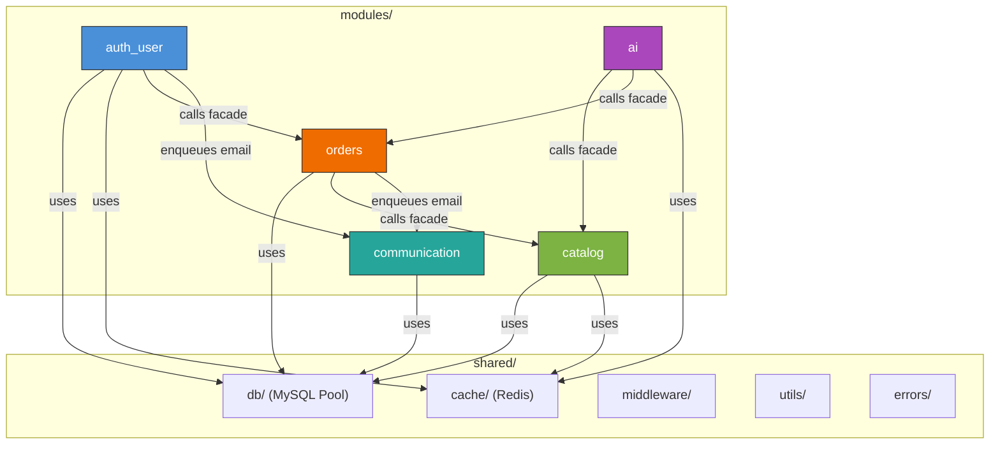

# Technical Specification: Modular Monolith Refactoring

> **Author:** @pm (Senior Product Manager)
> **Date:** 2026-09-10
> **Scope:** `server/src/` structural reorganization
> **Constraint:** Zero business logic & API regressions

---

## 1. Overview

This specification defines the structural refactoring of the DHP Store Express backend (`server/src/`) from a flat layered architecture into a **Modular Monolith**. The goal is to establish clear domain boundaries, enforce module isolation through public facades, and prepare the codebase for future scalability — all **without** changing any existing API routes, request/response contracts, or business logic.

### 1.1 Business Value

- **Maintainability:** Developers can reason about isolated domains instead of navigating a flat `routes/` directory where 970-line files mix routing, business logic, and SQL.
- **Testability:** Each module exposes a clean facade, enabling unit testing of services without HTTP/database coupling.
- **Scalability:** Module boundaries make future microservice extraction trivial — each module can be lifted out with its own data contracts intact.
- **Onboarding:** New contributors immediately understand domain ownership by reading a single `index.js` facade per module.

---

## 2. Architectural Audit — Current State

### 2.1 Current Directory Structure

```
server/src/
├── config.js                 # Env validation, dotenv
├── db.js                     # MySQL2 connection pool
├── index.js                  # Express bootstrap, route mounting, workers, shutdown
├── cache/
│   └── redis.js              # node-redis client (graceful degradation)
├── middleware/
│   ├── csrf.js               # Custom CSRF header check
│   ├── rateLimit.js          # Global, API, and Auth rate limiters
│   ├── requireAuth.js        # JWT cookie verification + Redis user cache
│   ├── requireRole.js        # Admin/Staff role guards
│   └── upload.js             # Multer disk storage configuration
├── routes/
│   ├── auth.js               # 454 lines — Auth, sessions, OAuth, profile, passwords
│   ├── products.js           # 971 lines — Product CRUD, variants, images, inventory, categories
│   ├── cart.js               # 242 lines — Cart CRUD, stock validation
│   ├── orders.js             # 510 lines — Order creation, payment intents, status management
│   ├── feedback.js           # 35 lines  — User feedback submission
│   ├── recommendations.js    # 148 lines — AI recommendation proxy, refresh trigger
│   ├── chat.js               # 52 lines  — AI chat proxy
│   ├── webhooks.js           # 64 lines  — Stripe webhook receiver
│   └── sitemap.js            # 81 lines  — Dynamic XML sitemap generator
├── queues/
│   ├── connection.js          # Shared IORedis BullMQ connection
│   ├── emailQueue.js          # Email job queue
│   ├── stripeQueue.js         # Stripe webhook processing queue
│   ├── aiRefreshQueue.js      # AI model refresh queue
│   ├── cacheQueue.js          # Cache invalidation queue
│   ├── cartCleanupQueue.js    # Abandoned cart cleanup (cron)
│   └── reservationCleanupQueue.js  # Reservation cleanup (cron)
├── workers/
│   ├── emailWorker.js         # Email template builder + send
│   ├── stripeWorker.js        # Stripe event reconciliation
│   ├── aiRefreshWorker.js     # AI service refresh trigger
│   ├── cacheWorker.js         # Redis SCAN cache invalidation
│   ├── cartCleanupWorker.js   # Abandoned cart soft-delete
│   └── reservationCleanupWorker.js  # Expired reservation release
├── utils/
│   ├── formatImageUrl.js      # Full URL construction from DB path
│   ├── generateSku.js         # Deterministic SKU generation
│   ├── mailer.js              # Nodemailer SMTP transporter
│   └── validatePassword.js    # Password complexity rules
└── uploads/                   # User-uploaded files (runtime)
```

### 2.2 Cross-Module Coupling Analysis

The following table maps every **cross-domain dependency** found in the current code:

| Source File | Imports From | Coupling Type | Severity |
|---|---|---|---|
| `routes/auth.js` | `queues/emailQueue.js` | Enqueues password-reset emails | ⚠️ Cross-domain side effect |
| `routes/auth.js` | `utils/formatImageUrl.js` | Formats profile picture URLs | ✅ Shared utility (fine) |
| `routes/auth.js` | `utils/validatePassword.js` | Password validation | ✅ Shared utility (fine) |
| `routes/auth.js:194` | **`orders` table directly** | `SELECT status, COUNT(*) FROM orders WHERE user_id = ?` | 🔴 **Direct cross-domain data access** |
| `routes/orders.js` | `queues/emailQueue.js` | Enqueues order-confirmation emails | ⚠️ Cross-domain side effect |
| `routes/orders.js` | **`products`, `product_variants`, `inventory` tables** | Reads prices, deducts inventory | 🔴 **Direct cross-domain data access** |
| `routes/orders.js` | **`carts`, `cart_items` tables** | Reads cart for checkout, clears cart | 🔴 **Direct cross-domain data access** |
| `routes/cart.js` | **`products`, `product_variants`, `inventory` tables** | Stock validation, price lookups | 🔴 **Direct cross-domain data access** |
| `routes/recommendations.js` | `routes/products.js` (`hydrateProducts`) | **Direct import of another route file's export** | 🔴 **Architectural violation** |
| `routes/recommendations.js` | `queues/aiRefreshQueue.js` | Enqueues AI refresh jobs | ✅ Correct queue usage |
| `routes/recommendations.js` | **`orders`, `order_items` tables** | Reads user purchase history | 🔴 **Direct cross-domain data access** |
| `routes/sitemap.js` | **`products` table** | Reads active product IDs | ⚠️ Read-only cross-domain |
| `routes/webhooks.js` | `queues/stripeQueue.js` | Enqueues webhook events | ✅ Correct queue usage |
| `workers/stripeWorker.js` | **`orders` table** | Updates order status | 🔴 **Direct cross-domain data access** |
| `workers/cartCleanupWorker.js` | **`carts`, `cart_items` tables** | Deletes abandoned carts | ✅ Owns these tables |
| `workers/reservationCleanupWorker.js` | **`inventory`, `inventory_reservations` tables** | Releases expired reservations | ⚠️ Inventory is catalog's domain |
| `middleware/requireAuth.js` | `db.js`, `cache/redis.js` | Looks up user by ID | ✅ Auth domain (correct) |

### 2.3 Critical Coupling Summary

1. **`auth.js` → `orders` table:** Profile endpoint queries order counts directly. Should call the orders module facade.
2. **`orders.js` → `products`/`inventory`/`carts` tables:** Order creation reads product prices, deducts inventory, and clears cart. These are the heaviest cross-domain transactions.
3. **`cart.js` → `products`/`inventory` tables:** Cart add/update validates stock against inventory.
4. **`recommendations.js` → `hydrateProducts` from `products.js`:** Direct import of a route file's exported function — the strongest architectural violation.
5. **`recommendations.js` → `orders`/`order_items` tables:** Reads purchase history for personalized recommendations.
6. **`stripeWorker.js` → `orders` table:** Updates order status on payment success.
7. **`reservationCleanupWorker.js` → `inventory` tables:** Releases expired reservations.

---

## 3. Module Boundary Design

### 3.1 Module Definitions

| Module | Domain Responsibility | Owned Database Tables |
|---|---|---|
| **`auth_user`** | Authentication, sessions, JWT tokens, OAuth, password management, profile CRUD, user roles | `users`, `refresh_tokens`, `password_resets` |
| **`catalog`** | Products, categories, variants, colors, sizes, inventory, product images, SKU generation, sitemap | `products`, `categories`, `product_variants`, `colors`, `sizes`, `inventory`, `product_images`, `inventory_reservations` |
| **`orders`** | Shopping cart, order lifecycle, checkout, payment intents, Stripe webhooks, order items | `carts`, `cart_items`, `orders`, `order_items` |
| **`ai`** | AI recommendation proxy, chat proxy, AI model refresh triggers | None (stateless proxy to Python service) |
| **`communication`** | Email transporter, email templates, email sending | `feedback` |

### 3.2 Module Dependency Graph



### 3.3 Allowed Cross-Module Calls (Facade Contracts)

#### `catalog/index.js` — Public Facade

```javascript
// Functions exposed by the catalog module for other modules to call

/**
 * Hydrate product rows with variants, images, inventory.
 * Used by: ai module (recommendation hydration)
 */
export { hydrateProducts } from './service.js';

/**
 * Fetch products by an array of IDs.
 * Used by: ai module (recommendation results), sitemap
 */
export { getProductsByIds } from './service.js';

/**
 * Fetch a product's price (base_price or variant price_override).
 * Used by: orders module (price verification at checkout)
 */
export { getVariantPrice, getProductBasePrice } from './service.js';

/**
 * Atomically deduct inventory for a variant.
 * Used by: orders module (stock deduction at order creation)
 */
export { deductInventory, restoreInventory } from './service.js';

/**
 * Check available stock for a variant.
 * Used by: orders module (stock validation)
 */
export { getAvailableStock } from './service.js';

/**
 * Get all active product IDs with update timestamps.
 * Used by: catalog/sitemap (and potentially other modules)
 */
export { getActiveProductSummaries } from './service.js';

/**
 * Express router for /api/products routes.
 */
export { default as catalogRouter } from './routes.js';
```

#### `orders/index.js` — Public Facade

```javascript
/**
 * Get order status counts for a given user.
 * Used by: auth_user module (profile page order stats)
 */
export { getOrderStatsByUserId } from './service.js';

/**
 * Get the most recent product ID purchased by a user.
 * Used by: ai module (personalized recommendations)
 */
export { getLastPurchasedProductId } from './service.js';

/**
 * Express routers.
 */
export { default as ordersRouter } from './routes.js';
export { default as webhooksRouter } from './webhooks.js';
```

#### `auth_user/index.js` — Public Facade

```javascript
/**
 * Express router for /api/auth routes.
 */
export { default as authRouter } from './routes.js';
```

#### `ai/index.js` — Public Facade

```javascript
/**
 * Express routers for /api/recommend and /api/chat routes.
 */
export { default as recommendRouter } from './routes/recommendations.js';
export { default as chatRouter } from './routes/chat.js';
```

#### `communication/index.js` — Public Facade

```javascript
/**
 * Email queue for enqueuing transactional emails.
 * Used by: auth_user module, orders module
 */
export { emailQueue } from './queues/emailQueue.js';

/**
 * Express router for /api/feedback routes.
 */
export { default as feedbackRouter } from './routes.js';
```

---

## 4. Target Directory Structure

```
server/src/
├── config.js                              # Environment validation (unchanged)
├── index.js                               # Express bootstrap, route mounting, graceful shutdown
│
├── shared/                                # Cross-cutting infrastructure
│   ├── db/
│   │   └── pool.js                        # MySQL2 connection pool (moved from db.js)
│   ├── cache/
│   │   └── redis.js                       # node-redis client (moved from cache/redis.js)
│   ├── middleware/
│   │   ├── csrf.js                        # CSRF header validation
│   │   ├── rateLimit.js                   # Rate limiters (global, api, auth)
│   │   ├── requireAuth.js                 # JWT verification + Redis user cache
│   │   ├── requireRole.js                 # Admin/Staff role guards
│   │   └── upload.js                      # Multer configuration
│   ├── errors/
│   │   └── AppError.js                    # Custom error class (NEW — optional enhancement)
│   ├── queues/
│   │   └── connection.js                  # Shared IORedis BullMQ connection config
│   └── utils/
│       ├── formatImageUrl.js              # Image URL constructor
│       ├── generateSku.js                 # SKU generator
│       └── validatePassword.js            # Password complexity validator
│
├── modules/
│   ├── auth_user/
│   │   ├── index.js                       # Public facade (re-exports authRouter)
│   │   ├── routes.js                      # /api/auth route definitions
│   │   ├── controller.js                  # HTTP request/response handling
│   │   ├── service.js                     # Auth business logic (token issuance, OAuth)
│   │   └── repository.js                  # User, refresh_tokens, password_resets SQL queries
│   │
│   ├── catalog/
│   │   ├── index.js                       # Public facade (hydrateProducts, getProductsByIds, etc.)
│   │   ├── routes.js                      # /api/products route definitions
│   │   ├── controller.js                  # HTTP request/response handling
│   │   ├── service.js                     # Product/variant/inventory business logic
│   │   ├── repository.js                  # Products, variants, colors, sizes, inventory SQL
│   │   ├── sitemap.js                     # /sitemap.xml route (uses catalog service)
│   │   ├── queues/
│   │   │   ├── cacheQueue.js              # Cache invalidation queue
│   │   │   └── reservationCleanupQueue.js # Expired reservation cleanup queue (cron)
│   │   └── workers/
│   │       ├── cacheWorker.js             # Redis SCAN cache invalidation worker
│   │       └── reservationCleanupWorker.js # Expired reservation cleanup worker
│   │
│   ├── orders/
│   │   ├── index.js                       # Public facade (getOrderStatsByUserId, etc.)
│   │   ├── routes.js                      # /api/orders and /api/cart route definitions
│   │   ├── controller.js                  # HTTP request/response handling
│   │   ├── service.js                     # Order/cart business logic
│   │   ├── repository.js                  # Orders, order_items, carts, cart_items SQL
│   │   ├── webhooks.js                    # /api/webhooks/stripe route
│   │   ├── queues/
│   │   │   ├── stripeQueue.js             # Stripe webhook processing queue
│   │   │   └── cartCleanupQueue.js        # Abandoned cart cleanup queue (cron)
│   │   └── workers/
│   │       ├── stripeWorker.js            # Stripe event reconciliation worker
│   │       └── cartCleanupWorker.js       # Abandoned cart cleanup worker
│   │
│   ├── ai/
│   │   ├── index.js                       # Public facade (recommendRouter, chatRouter)
│   │   ├── routes/
│   │   │   ├── recommendations.js         # /api/recommend routes
│   │   │   └── chat.js                    # /api/chat routes
│   │   ├── service.js                     # AI proxy business logic
│   │   ├── queues/
│   │   │   └── aiRefreshQueue.js          # AI refresh queue
│   │   └── workers/
│   │       └── aiRefreshWorker.js         # AI refresh trigger worker
│   │
│   └── communication/
│       ├── index.js                       # Public facade (emailQueue, feedbackRouter)
│       ├── routes.js                      # /api/feedback route
│       ├── controller.js                  # HTTP request/response handling
│       ├── service.js                     # Feedback insertion logic
│       ├── repository.js                  # Feedback SQL queries
│       ├── mailer.js                      # Nodemailer transporter (moved from utils/)
│       ├── queues/
│       │   └── emailQueue.js              # Email job queue
│       └── workers/
│           └── emailWorker.js             # Email template builder + send worker
│
└── uploads/                               # User-uploaded files (unchanged)
```

### 4.1 Key Design Decisions

| Decision | Rationale |
|---|---|
| **Cart routes live in `orders/`** | Cart is a pre-order concept. Cart → Checkout → Order is a single domain lifecycle. Keeping them together avoids facade overhead for the tight cart↔order data flow. |
| **Webhooks live in `orders/`** | Stripe webhooks exclusively update order status. This keeps payment processing colocated with order lifecycle management. |
| **`reservationCleanupQueue` and `reservationCleanupWorker` in `catalog/`** | Both the reservation cleanup queue and its worker belong to the `catalog` module because they manage inventory reservations (`inventory_reservations` and `inventory` tables). Colocating the queue, worker, and data owner within `catalog` ensures domain cohesion and prevents cross-boundary queue coupling. |
| **Sitemap lives in `catalog/`** | Sitemap queries product data exclusively. It's a read-only view of the catalog domain. |
| **`communication/` owns `feedback`** | Feedback is a write-only contact form that may later trigger email notifications. It's too small for its own module but naturally fits with communication. |
| **Shared `queues/connection.js`** | All BullMQ queues and workers share the same IORedis connection config. This stays in `shared/` since it's infrastructure, not domain logic. |
| **No new dependencies** | The refactoring uses zero new npm packages. All cross-module calls are plain JavaScript function imports through module facades. |

---

## 5. Cross-Module Communication Patterns

### 5.1 Pattern: Synchronous Facade Call

**Example: Order creation verifying product price and deducting inventory**

```
┌──────────────┐              ┌──────────────┐
│   orders/    │   import     │   catalog/   │
│  service.js  │ ──────────── │   index.js   │
│              │              │   (facade)   │
│  createOrder │              ├──────────────┤
│     │        │              │ getVariant   │
│     ├──────► │──────call───►│   Price()    │
│     │        │              │              │
│     ├──────► │──────call───►│ deductInven  │
│     │        │              │   tory()     │
│     │        │              └──────────────┘
└──────────────┘
```

**Concrete code example (after refactoring):**

```javascript
// modules/orders/service.js
import { getVariantPrice, deductInventory } from '../catalog/index.js';

export async function createOrder(conn, items) {
  for (const item of items) {
    // Cross-module call through facade — NO direct SQL
    const price = await getVariantPrice(item.variant_id, conn);
    await deductInventory(item.variant_id, item.qty, conn);
    // ... create order items
  }
}
```

```javascript
// modules/catalog/service.js (facade-exposed functions)
export async function getVariantPrice(variantId, conn = pool) {
  const [rows] = await conn.execute(
    `SELECT COALESCE(pv.price_override, p.base_price) AS price
     FROM product_variants pv
     JOIN products p ON pv.product_id = p.id
     WHERE pv.id = ?`,
    [variantId]
  );
  return rows.length > 0 ? Number(rows[0].price) : null;
}

export async function deductInventory(variantId, quantity, conn = pool) {
  const [inv] = await conn.execute(
    'SELECT quantity, reserved_quantity FROM inventory WHERE variant_id = ? FOR UPDATE',
    [variantId]
  );
  if (inv.length === 0 || (inv[0].quantity - inv[0].reserved_quantity) < quantity) {
    throw new Error('Insufficient stock');
  }
  await conn.execute(
    'UPDATE inventory SET quantity = quantity - ? WHERE variant_id = ?',
    [quantity, variantId]
  );
}
```

### 5.2 Pattern: Async Side Effect via BullMQ Queue

**Example: Order creation triggering a confirmation email**

```
┌──────────────┐     enqueue      ┌─────────────────┐     process     ┌─────────────────┐
│   orders/    │ ───────────────► │ communication/   │ ─────────────► │ communication/   │
│ controller.js│                  │ queues/emailQueue│                 │ workers/email    │
│              │                  │                  │                 │   Worker.js      │
│  (after      │                  │ { to, template,  │                 │ (builds HTML +   │
│   commit)    │                  │   data }         │                 │   sends email)   │
└──────────────┘                  └─────────────────┘                 └─────────────────┘
```

The communication module's `emailQueue` is imported via the facade:

```javascript
// modules/orders/controller.js
import { emailQueue } from '../communication/index.js';

// After successful order commit:
await emailQueue.add('order-confirmation', {
  type: 'email',
  to: deliveryInfo.email,
  template: 'order-confirmation',
  data: { orderId, customerName: deliveryInfo.name, total: finalTotal },
});
```

### 5.3 Pattern: Cross-Module Read for Profile Aggregation

**Example: Auth profile fetching order statistics**

```javascript
// modules/auth_user/service.js
// Note: In Phase 3, auth_user temporarily imports getOrderStatsByUserId from legacy ../../routes/orders.js
// to prevent ESM startup crashes. In Phase 5, this is rewired to ../orders/index.js once orders is extracted.
import { getOrderStatsByUserId } from '../orders/index.js';

export async function getProfile(userId) {
  // ... fetch user data from auth_user/repository.js
  const orderStats = await getOrderStatsByUserId(userId);
  return { ...userData, orders: orderStats };
}
```

```javascript
// modules/orders/service.js (facade-exposed)
export async function getOrderStatsByUserId(userId) {
  const [counts] = await pool.execute(
    `SELECT status, COUNT(*) as count FROM orders WHERE user_id = ? GROUP BY status`,
    [userId]
  );
  const stats = { new: 0, confirmed: 0, shipping: 0, received: 0, cancelled: 0 };
  counts.forEach(row => {
    if (stats[row.status] !== undefined) stats[row.status] = row.count;
  });
  return stats;
}
```

### 5.4 Pattern: AI Module Calling Catalog + Orders Facades

**Example: Personalized recommendations**

```javascript
// modules/ai/service.js
import { getProductsByIds, hydrateProducts } from '../catalog/index.js';
import { getLastPurchasedProductId } from '../orders/index.js';

export async function getUserRecommendations(userId) {
  const lastProductId = await getLastPurchasedProductId(userId);
  // ... call Python AI service with lastProductId
  // ... hydrate returned IDs via catalog facade
  const products = await getProductsByIds(similarIds);
  return products;
}
```

---

## 6. Module Communication Rules

### 6.1 Rules

| # | Rule | Enforcement |
|---|---|---|
| 1 | **No cross-module repository imports.** Module A must never import `moduleB/repository.js`. | Code review + ESLint `no-restricted-imports` (future) |
| 2 | **All cross-module calls go through `index.js` facade.** | Each module's `index.js` is the only file other modules may import from. |
| 3 | **No direct SQL to tables owned by another module.** | E.g., `orders/` must not contain `SELECT ... FROM products`. Use catalog facade. |
| 4 | **Shared infrastructure (`shared/`) has no domain logic.** | `shared/` contains only connection pools, middleware, error classes, and generic utilities. |
| 5 | **Workers may use their owning module's repository.** | E.g., `catalog/workers/cacheWorker.js` may use `catalog/repository.js`. |
| 6 | **Queue definitions and workers live with the domain data owner.** | E.g., `reservationCleanupQueue` and `reservationCleanupWorker` live in `catalog/` (managing catalog inventory); `emailQueue` and `emailWorker` live in `communication/`; `stripeQueue` and `cartCleanupQueue` live in `orders/`. |
| 7 | **Transaction connections may be passed as parameters across facades.** | When a checkout transaction spans catalog (inventory deduction) and orders (order creation), the same `conn` is passed. |

### 6.2 Exception: Checkout Transaction

The order creation flow requires a **single database transaction** spanning both `orders` and `catalog` table operations (create order + deduct inventory). This is the one case where a transaction connection (`conn`) crosses module boundaries:

```javascript
// orders/service.js
conn = await pool.getConnection();
await conn.beginTransaction();

// Cross-module: pass conn to catalog functions
await deductInventory(item.variant_id, item.qty, conn);

// Same transaction: insert order
await insertOrder(conn, orderData);

await conn.commit();
```

This is acceptable because:
1. The transaction boundary is owned by the **calling module** (orders).
2. The catalog functions accept an **optional connection parameter** — they don't create their own transactions.
3. If microservice extraction happens later, this will become a Saga pattern, but for a monolith this is the correct approach.

---

## 7. Worker & Queue Ownership Matrix

| Queue | Queue Location | Worker | Worker Location | Produced By | Domain Owner |
|---|---|---|---|---|---|
| `email` | `communication/queues/` | `emailWorker` | `communication/workers/` | `auth_user`, `orders` | communication |
| `stripe-webhook` | `orders/queues/` | `stripeWorker` | `orders/workers/` | `orders/webhooks.js` | orders |
| `cache-invalidate` | `catalog/queues/` | `cacheWorker` | `catalog/workers/` | `catalog/controller.js` | catalog |
| `ai-refresh` | `ai/queues/` | `aiRefreshWorker` | `ai/workers/` | `ai/routes/recommendations.js` | ai |
| `cart-cleanup` | `orders/queues/` | `cartCleanupWorker` | `orders/workers/` | `index.js` (cron schedule) | orders |
| `reservation-cleanup` | `catalog/queues/` | `reservationCleanupWorker` | `catalog/workers/` | `index.js` (cron schedule) | catalog |

---

## 8. API Route Mapping (Zero Change Guarantee)

The following table proves that every existing route path maps identically after refactoring:

| Current Route | Current File | New Module | New File | Path Unchanged |
|---|---|---|---|---|
| `POST /api/auth/register` | `routes/auth.js` | `auth_user` | `modules/auth_user/routes.js` | ✅ |
| `POST /api/auth/login` | `routes/auth.js` | `auth_user` | `modules/auth_user/routes.js` | ✅ |
| `POST /api/auth/refresh` | `routes/auth.js` | `auth_user` | `modules/auth_user/routes.js` | ✅ |
| `POST /api/auth/logout` | `routes/auth.js` | `auth_user` | `modules/auth_user/routes.js` | ✅ |
| `GET /api/auth/profile` | `routes/auth.js` | `auth_user` | `modules/auth_user/routes.js` | ✅ |
| `POST /api/auth/upload-profile-picture` | `routes/auth.js` | `auth_user` | `modules/auth_user/routes.js` | ✅ |
| `PUT /api/auth/profile` | `routes/auth.js` | `auth_user` | `modules/auth_user/routes.js` | ✅ |
| `POST /api/auth/forgot-password` | `routes/auth.js` | `auth_user` | `modules/auth_user/routes.js` | ✅ |
| `POST /api/auth/change-password` | `routes/auth.js` | `auth_user` | `modules/auth_user/routes.js` | ✅ |
| `POST /api/auth/reset-password` | `routes/auth.js` | `auth_user` | `modules/auth_user/routes.js` | ✅ |
| `POST /api/auth/google` | `routes/auth.js` | `auth_user` | `modules/auth_user/routes.js` | ✅ |
| `GET /api/products` | `routes/products.js` | `catalog` | `modules/catalog/routes.js` | ✅ |
| `POST /api/products/batch` | `routes/products.js` | `catalog` | `modules/catalog/routes.js` | ✅ |
| `GET /api/products/categories` | `routes/products.js` | `catalog` | `modules/catalog/routes.js` | ✅ |
| `GET /api/products/colors` | `routes/products.js` | `catalog` | `modules/catalog/routes.js` | ✅ |
| `GET /api/products/:id` | `routes/products.js` | `catalog` | `modules/catalog/routes.js` | ✅ |
| `POST /api/products` | `routes/products.js` | `catalog` | `modules/catalog/routes.js` | ✅ |
| `PUT /api/products/variants/:variantId/inventory` | `routes/products.js` | `catalog` | `modules/catalog/routes.js` | ✅ |
| `PUT /api/products/variants/:variantId` | `routes/products.js` | `catalog` | `modules/catalog/routes.js` | ✅ |
| `POST /api/products/:id/variants` | `routes/products.js` | `catalog` | `modules/catalog/routes.js` | ✅ |
| `DELETE /api/products/variants/:variantId` | `routes/products.js` | `catalog` | `modules/catalog/routes.js` | ✅ |
| `PUT /api/products/:id/stock` | `routes/products.js` | `catalog` | `modules/catalog/routes.js` | ✅ |
| `DELETE /api/products/:id` | `routes/products.js` | `catalog` | `modules/catalog/routes.js` | ✅ |
| `GET /api/cart` | `routes/cart.js` | `orders` | `modules/orders/routes.js` | ✅ |
| `POST /api/cart/add` | `routes/cart.js` | `orders` | `modules/orders/routes.js` | ✅ |
| `POST /api/cart/update` | `routes/cart.js` | `orders` | `modules/orders/routes.js` | ✅ |
| `POST /api/orders` | `routes/orders.js` | `orders` | `modules/orders/routes.js` | ✅ |
| `GET /api/orders` | `routes/orders.js` | `orders` | `modules/orders/routes.js` | ✅ |
| `POST /api/orders/create-payment` | `routes/orders.js` | `orders` | `modules/orders/routes.js` | ✅ |
| `PUT /api/orders/:id/cancel` | `routes/orders.js` | `orders` | `modules/orders/routes.js` | ✅ |
| `GET /api/orders/admin/all` | `routes/orders.js` | `orders` | `modules/orders/routes.js` | ✅ |
| `PUT /api/orders/:id/status` | `routes/orders.js` | `orders` | `modules/orders/routes.js` | ✅ |
| `POST /api/webhooks/stripe` | `routes/webhooks.js` | `orders` | `modules/orders/webhooks.js` | ✅ |
| `POST /api/feedback` | `routes/feedback.js` | `communication` | `modules/communication/routes.js` | ✅ |
| `GET /api/recommend/product/:id` | `routes/recommendations.js` | `ai` | `modules/ai/routes/recommendations.js` | ✅ |
| `GET /api/recommend/user` | `routes/recommendations.js` | `ai` | `modules/ai/routes/recommendations.js` | ✅ |
| `POST /api/recommend/refresh` | `routes/recommendations.js` | `ai` | `modules/ai/routes/recommendations.js` | ✅ |
| `POST /api/chat` | `routes/chat.js` | `ai` | `modules/ai/routes/chat.js` | ✅ |
| `GET /api/health` | `index.js` (inline) | — | `index.js` (stays inline) | ✅ |
| `GET /sitemap.xml` | `routes/sitemap.js` | `catalog` | `modules/catalog/sitemap.js` | ✅ |

---

## 9. Step-by-Step Implementation Roadmap

### Phase 1: Extract `shared/` Infrastructure

**Files to create/move:**

| Action | Source | Destination |
|---|---|---|
| MOVE | `db.js` | `shared/db/pool.js` |
| MOVE | `cache/redis.js` | `shared/cache/redis.js` |
| MOVE | `middleware/csrf.js` | `shared/middleware/csrf.js` |
| MOVE | `middleware/rateLimit.js` | `shared/middleware/rateLimit.js` |
| MOVE | `middleware/requireAuth.js` | `shared/middleware/requireAuth.js` |
| MOVE | `middleware/requireRole.js` | `shared/middleware/requireRole.js` |
| MOVE | `middleware/upload.js` | `shared/middleware/upload.js` |
| MOVE | `queues/connection.js` | `shared/queues/connection.js` |
| MOVE | `utils/formatImageUrl.js` | `shared/utils/formatImageUrl.js` |
| MOVE | `utils/generateSku.js` | `shared/utils/generateSku.js` |
| MOVE | `utils/validatePassword.js` | `shared/utils/validatePassword.js` |
| NEW | — | `shared/errors/AppError.js` |

**Legacy Import Updates (Critical):**
Immediately update import paths in all legacy files to prevent broken references:
1. `shared/middleware/requireAuth.js`: update imports to `../db/pool.js` and `../cache/redis.js`.
2. `server/src/index.js`: update imports for middleware (`./shared/middleware/*`).
3. Legacy `routes/*.js` (`auth.js`, `products.js`, `cart.js`, `orders.js`, `feedback.js`, `recommendations.js`, `chat.js`, `webhooks.js`, `sitemap.js`):
   - Update `../db.js` → `../shared/db/pool.js`
   - Update `../cache/redis.js` → `../shared/cache/redis.js`
   - Update `../middleware/*` → `../shared/middleware/*`
   - Update `../utils/*` → `../shared/utils/*`
4. Legacy `workers/*.js`:
   - Update `../db.js` → `../shared/db/pool.js`
   - Update `../cache/redis.js` → `../shared/cache/redis.js`
   - Update `../queues/connection.js` → `../shared/queues/connection.js`
5. Legacy `queues/*.js`:
   - Update `../queues/connection.js` or `./connection.js` → `../shared/queues/connection.js`
6. `server/migrations/004_catalog_schema_enhance.js`:
   - Update `../src/db.js` → `../src/shared/db/pool.js`

**Verification:** Run `npm run lint`. Verify server starts cleanly with `node src/index.js` (or `npm run dev`).

---

### Phase 2: Extract `communication` Module

**Rationale:** Smallest module with zero incoming domain dependencies. Safest first module extraction.

| Action | Source | Destination |
|---|---|---|
| MOVE | `routes/feedback.js` → split into | `modules/communication/routes.js` + `controller.js` + `service.js` + `repository.js` |
| MOVE | `queues/emailQueue.js` | `modules/communication/queues/emailQueue.js` |
| MOVE | `workers/emailWorker.js` | `modules/communication/workers/emailWorker.js` |
| MOVE | `utils/mailer.js` | `modules/communication/mailer.js` |
| NEW | — | `modules/communication/index.js` (facade) |

**Facade Definition (`modules/communication/index.js`):**
- Export `{ emailQueue }` from `./queues/emailQueue.js`
- Export `default` (or `{ feedbackRouter }`) from `./routes.js`

**Legacy Import Updates (Critical):**
1. `routes/auth.js`: Update `import { emailQueue } from '../queues/emailQueue.js'` → `import { emailQueue } from '../modules/communication/index.js'`
2. `routes/orders.js`: Update `import { emailQueue } from '../queues/emailQueue.js'` → `import { emailQueue } from '../modules/communication/index.js'`
3. `server/src/index.js`:
   - Update `import feedbackRouter from './routes/feedback.js'` → `import { feedbackRouter } from './modules/communication/index.js'`
   - Update `import { emailQueue } from './queues/emailQueue.js'` → `import { emailQueue } from './modules/communication/index.js'`
   - Update `import './workers/emailWorker.js'` → `import './modules/communication/workers/emailWorker.js'`

**Verification:** Run `npm run lint`. Server boots without errors.

---

### Phase 3: Extract `auth_user` Module

| Action | Source | Destination |
|---|---|---|
| MOVE | `routes/auth.js` → split into | `modules/auth_user/routes.js` + `controller.js` + `service.js` + `repository.js` |
| NEW | — | `modules/auth_user/index.js` (facade) |

**Facade Definition (`modules/auth_user/index.js`):**
- Export `default` (or `{ authRouter }`) from `./routes.js`

**Preventing ESM Startup Crash (Fix 1):**
In native Node.js ES Modules, static imports must resolve to existing files at boot time. Because `modules/orders/index.js` is not created until Phase 5:
- Export `getOrderStatsByUserId` from legacy `routes/orders.js`.
- In `modules/auth_user/service.js`, import `getOrderStatsByUserId` temporarily from legacy `../../routes/orders.js` (instead of a forward reference to non-existent `../orders/index.js`).
- Import `emailQueue` from `../communication/index.js`.

**Legacy Import Updates (Critical):**
1. `server/src/index.js`:
   - Update `import authRouter from './routes/auth.js'` → `import { authRouter } from './modules/auth_user/index.js'`

**Verification:** Run `npm run lint`. Server boots without errors.

---

### Phase 4: Extract `catalog` Module

| Action | Source | Destination |
|---|---|---|
| MOVE | `routes/products.js` → split into | `modules/catalog/routes.js` + `controller.js` + `service.js` + `repository.js` |
| MOVE | `routes/sitemap.js` | `modules/catalog/sitemap.js` |
| MOVE | `queues/cacheQueue.js` | `modules/catalog/queues/cacheQueue.js` |
| MOVE | `queues/reservationCleanupQueue.js` | `modules/catalog/queues/reservationCleanupQueue.js` |
| MOVE | `workers/cacheWorker.js` | `modules/catalog/workers/cacheWorker.js` |
| MOVE | `workers/reservationCleanupWorker.js` | `modules/catalog/workers/reservationCleanupWorker.js` |
| NEW | — | `modules/catalog/index.js` (facade) |

**Queue Boundary Correction (Fix 2):**
`reservationCleanupQueue.js` is placed in `modules/catalog/queues/` directly alongside `reservationCleanupWorker.js` in `modules/catalog/workers/` because they manage `inventory_reservations` and `inventory` tables owned by `catalog`.

**Facade Definition (`modules/catalog/index.js`):**
- Export `{ default as catalogRouter }` from `./routes.js`
- Export `{ default as sitemapRouter }` from `./sitemap.js`
- Export `{ cacheQueue }` from `./queues/cacheQueue.js`
- Export `{ reservationCleanupQueue, scheduleReservationCleanup }` from `./queues/reservationCleanupQueue.js`
- Export `{ hydrateProducts, getProductsByIds, getVariantPrice, getProductBasePrice, deductInventory, restoreInventory, getAvailableStock, getActiveProductSummaries }` from `./service.js`

**Legacy Import Updates (Critical):**
1. `routes/recommendations.js`:
   - Replace `import { hydrateProducts } from './products.js'` → `import { hydrateProducts } from '../modules/catalog/index.js'`
2. `routes/cart.js`:
   - Update stock/price validation helpers to import from `../modules/catalog/index.js`
3. `routes/orders.js`:
   - Update product price and inventory deduction calls to import from `../modules/catalog/index.js`
4. `server/src/index.js`:
   - Update `import productsRouter from './routes/products.js'` → `import { catalogRouter } from './modules/catalog/index.js'`
   - Update `import sitemapRouter from './routes/sitemap.js'` → `import { sitemapRouter } from './modules/catalog/index.js'`
   - Update `import { cacheQueue }` → from `./modules/catalog/index.js`
   - Update `import { reservationCleanupQueue, scheduleReservationCleanup }` → from `./modules/catalog/index.js`
   - Update worker imports for `cacheWorker.js` and `reservationCleanupWorker.js` to `./modules/catalog/workers/*`

**Verification:** Run `npm run lint`. Server boots without errors.

---

### Phase 5: Extract `orders` Module

| Action | Source | Destination |
|---|---|---|
| MOVE | `routes/orders.js` → split into | `modules/orders/routes.js` + `controller.js` + `service.js` + `repository.js` |
| MOVE | `routes/cart.js` → merge into | `modules/orders/routes.js` (cart endpoints) |
| MOVE | `routes/webhooks.js` | `modules/orders/webhooks.js` |
| MOVE | `queues/stripeQueue.js` | `modules/orders/queues/stripeQueue.js` |
| MOVE | `queues/cartCleanupQueue.js` | `modules/orders/queues/cartCleanupQueue.js` |
| MOVE | `workers/stripeWorker.js` | `modules/orders/workers/stripeWorker.js` |
| MOVE | `workers/cartCleanupWorker.js` | `modules/orders/workers/cartCleanupWorker.js` |
| NEW | — | `modules/orders/index.js` (facade) |

**Facade Definition (`modules/orders/index.js`):**
- Export `{ default as ordersRouter, cartRouter }` from `./routes.js`
- Export `{ default as webhooksRouter }` from `./webhooks.js`
- Export `{ stripeQueue }` from `./queues/stripeQueue.js`
- Export `{ cartCleanupQueue, scheduleCartCleanup }` from `./queues/cartCleanupQueue.js`
- Export `{ getOrderStatsByUserId, getLastPurchasedProductId }` from `./service.js`

**Rewiring & Legacy Import Updates (Critical):**
1. `modules/auth_user/service.js`:
   - Rewire `getOrderStatsByUserId`: Replace temporary import `from '../../routes/orders.js'` with `import { getOrderStatsByUserId } from '../orders/index.js'`.
2. `modules/orders/service.js`:
   - Import catalog functions (`getVariantPrice`, `deductInventory`, etc.) from `../catalog/index.js`.
   - Import `emailQueue` from `../communication/index.js`.
3. `server/src/index.js`:
   - Update `import ordersRouter from './routes/orders.js'` → `import { ordersRouter } from './modules/orders/index.js'`
   - Update `import cartRouter from './routes/cart.js'` → `import { cartRouter } from './modules/orders/index.js'`
   - Update `import webhooksRouter from './routes/webhooks.js'` → `import { webhooksRouter } from './modules/orders/index.js'`
   - Update `import { stripeQueue }` and `import { cartCleanupQueue, scheduleCartCleanup }` → from `./modules/orders/index.js`
   - Update worker imports for `stripeWorker.js` and `cartCleanupWorker.js` to `./modules/orders/workers/*`

**Verification:** Run `npm run lint`. Server boots without errors.

---

### Phase 6: Extract `ai` Module

| Action | Source | Destination |
|---|---|---|
| MOVE | `routes/recommendations.js` → split into | `modules/ai/routes/recommendations.js` + `service.js` |
| MOVE | `routes/chat.js` | `modules/ai/routes/chat.js` |
| MOVE | `queues/aiRefreshQueue.js` | `modules/ai/queues/aiRefreshQueue.js` |
| MOVE | `workers/aiRefreshWorker.js` | `modules/ai/workers/aiRefreshWorker.js` |
| NEW | — | `modules/ai/index.js` (facade) |

**Facade Definition (`modules/ai/index.js`):**
- Export `{ default as recommendRouter }` from `./routes/recommendations.js`
- Export `{ default as chatRouter }` from `./routes/chat.js`
- Export `{ aiRefreshQueue }` from `./queues/aiRefreshQueue.js`

**Cross-module Imports:**
- `modules/ai/service.js` imports `hydrateProducts`, `getProductsByIds` from `../catalog/index.js`
- `modules/ai/service.js` imports `getLastPurchasedProductId` from `../orders/index.js`

**Legacy Import Updates (Critical):**
1. `server/src/index.js`:
   - Update `import recommendRouter from './routes/recommendations.js'` → `import { recommendRouter } from './modules/ai/index.js'`
   - Update `import chatRouter from './routes/chat.js'` → `import { chatRouter } from './modules/ai/index.js'`
   - Update `import { aiRefreshQueue }` → from `./modules/ai/index.js`
   - Update `import './workers/aiRefreshWorker.js'` → `import './modules/ai/workers/aiRefreshWorker.js'`

**Verification:** Run `npm run lint`. Server boots without errors.

---

### Phase 7: Rewire `index.js` Entry Point & Audit

1. Audit `server/src/index.js`:
   - 100% of routers, middleware, queues, and workers are imported from `shared/` or `modules/*/index.js`.
   - Zero imports remain pointing to legacy `routes/`, `queues/`, `workers/`, `utils/`, or `middleware/`.
2. Confirm identical middleware mount order, route prefixes, Bull Board queue bindings, and graceful shutdown handlers.

---

### Phase 8: Cleanup & Verification

1. Remove legacy empty directories: `server/src/routes/`, `server/src/queues/`, `server/src/workers/`, `server/src/utils/`, `server/src/cache/`, `server/src/middleware/`, and root `server/src/db.js`.
2. Run full linter: `npm run lint` in `server/`.
3. Perform end-to-end verification checklist (Section 10).

---

## 10. Verification Checklist

### 10.1 Structural Verification

- [ ] All files in `server/src/routes/` have been moved to module directories
- [ ] All files in `server/src/workers/` have been moved to module directories
- [ ] All files in `server/src/queues/` (except `connection.js`) have been moved
- [ ] All files in `server/src/utils/` have been moved to `shared/utils/`
- [ ] `server/src/cache/redis.js` moved to `shared/cache/redis.js`
- [ ] `server/src/db.js` moved to `shared/db/pool.js`
- [ ] `server/src/middleware/` moved to `shared/middleware/`
- [ ] Every module has an `index.js` facade
- [ ] No module imports another module's `repository.js` directly
- [ ] No module imports another module's internal files (only `index.js`)

### 10.2 Functional Verification

- [ ] `npm run lint` passes with zero errors in `server/`
- [ ] Server starts without errors (`npm run dev`)
- [ ] `GET /api/health` returns `{ ok: true }`
- [ ] `POST /api/auth/register` — user registration works
- [ ] `POST /api/auth/login` — login returns cookies
- [ ] `GET /api/auth/profile` — returns user data with order stats
- [ ] `GET /api/products` — returns product list with variants
- [ ] `GET /api/products/:id` — returns single product
- [ ] `POST /api/cart/add` — adds item to cart
- [ ] `GET /api/cart` — returns cart items
- [ ] `POST /api/orders` — creates order, deducts inventory
- [ ] `PUT /api/orders/:id/cancel` — cancels order, restores inventory
- [ ] `POST /api/orders/create-payment` — returns Stripe client secret
- [ ] `POST /api/webhooks/stripe` — accepts webhook with raw body
- [ ] `POST /api/feedback` — submits feedback
- [ ] `GET /api/recommend/product/:id` — returns recommendations
- [ ] `GET /api/recommend/user` — returns personalized recommendations
- [ ] `POST /api/chat` — forwards to AI service
- [ ] `GET /sitemap.xml` — returns valid XML sitemap
- [ ] Bull Board dashboard loads at `/admin/queues` (non-production)
- [ ] All BullMQ workers start and process jobs
- [ ] Cart cleanup cron is scheduled
- [ ] Reservation cleanup cron is scheduled
- [ ] Graceful shutdown closes workers, queues, and HTTP server

### 10.3 Regression Safety Nets

- [ ] All route paths are identical (see Section 8 mapping table)
- [ ] All HTTP methods are identical
- [ ] All request body/query parameter parsing is identical
- [ ] All response JSON shapes are identical
- [ ] All HTTP status codes are identical
- [ ] All middleware chains are identical (rate limiters, auth, role guards)
- [ ] All error messages are identical
- [ ] Redis caching behavior is identical (keys, TTLs, graceful degradation)
- [ ] Webhook raw body parsing order is preserved (before `express.json()`)

---

## 11. Security Considerations

- **No new attack surface:** This is a structural refactoring with zero new endpoints, dependencies, or external integrations.
- **Middleware chain preserved:** All rate limiters, CSRF protection, auth guards, and role checks are moved as-is to `shared/middleware/` and applied identically.
- **Transaction integrity preserved:** All existing `getConnection()` → `beginTransaction()` → `commit()`/`rollback()` → `release()` patterns are maintained verbatim.
- **No secret changes:** No new environment variables are introduced.

---

## 12. Deployment Impact

- **Zero Docker changes required:** The entry point is still `server/src/index.js`.
- **Zero environment variable changes:** No new env vars.
- **Zero migration changes:** No database schema changes.
- **Zero client changes:** The React frontend continues to call the same API routes.
- **Zero AI service changes:** The Python service receives the same HTTP requests.

---

## 13. Acceptance Criteria

- [ ] All existing API routes return identical responses (path, method, status code, body shape)
- [ ] Every module has a clean `index.js` facade exposing only public contracts
- [ ] No module directly imports another module's `repository.js` or internal files
- [ ] `npm run lint` passes with zero errors
- [ ] Server boots and all workers start successfully
- [ ] All BullMQ cron schedules (cart cleanup, reservation cleanup) are active
- [ ] The `routes/`, `queues/`, `workers/`, `utils/`, `cache/`, and `middleware/` top-level directories are removed
- [ ] The refactored code follows all patterns in `.agents/architecture.md`
